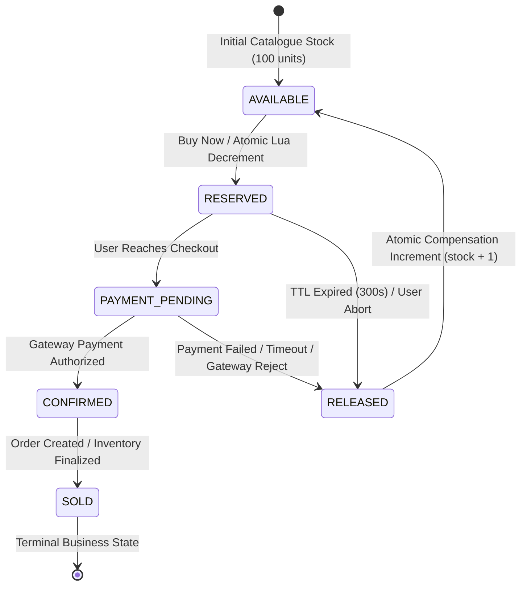

# SALESTORM — Inventory Concurrency, State Machine & Invariant Proofs

**Document Version:** 1.0.0  
**Status:** Approved Architecture Baseline  
**Lead Author:** Member 1 (System Architect + Concurrency, Inventory & Scalability Lead)  
**Target Audience:** Core Engineering Team (Members 2, 3, 4), Technical Jury, Operations  

---

## 1. The Core Concurrency Problem: 10,000 Contenders for 100 Units

The fundamental engineering challenge of SALESTORM is resolving **extreme write contention** on a single logical record:
- **Available Stock:** Exactly $S = 100$ units.
- **Concurrent Purchase Requests:** Exactly $N = 10,000$ incoming requests at timestamp $t = 0$.
- **Constraint:** Zero overselling ($S_{\text{sold}} \le 100$), zero negative balance ($S_{\text{available}} \ge 0$), deterministic resolution of the final unit, and complete protection against duplicate requests.

---

## 2. Exhaustive Comparison of Concurrency Control Strategies

The hackathon brief explicitly mandates the rigorous comparison of concurrency strategies. We analyze three paradigms:

```
┌────────────────────────────────────────────────────────────────────────────────────────┐
│                        CONCURRENCY STRATEGY COMPARISON SPECTRUM                        │
├─────────────────────────┬───────────────────────────┬──────────────────────────────────┤
│ Approach A: Optimistic  │ Approach B: Pessimistic   │ Approach C: Multi-Tier Hybrid    │
│ (OCC / Version Control) │ (Row-Level Locking)       │ (Redis Atomic Lua + DB Outbox)   │
└─────────────────────────┴───────────────────────────┴──────────────────────────────────┘
```

### Detailed Concurrency Comparison Matrix

| Evaluation Dimension | Approach A: Optimistic Concurrency (OCC) | Approach B: Pessimistic Locking (`SELECT FOR UPDATE`) | Approach C: Multi-Tiered Hybrid (Redis Lua + PostgreSQL OCC) |
| :--- | :--- | :--- | :--- |
| **How It Works** | Reads record version $V$. Updates: `WHERE id = X AND version = V`. If version mismatch, transaction fails/retries. | Acquires exclusive row-level lock (`FOR UPDATE`), serializing all access at database engine level. | Single-threaded in-memory Lua script executes atomic check-and-decrement. Only winners write to DB via Outbox. |
| **Transaction Behavior** | Non-blocking reads. Commits write only if version is unchanged; rollbacks on collision. | Blocking. Each concurrent thread halts and waits in DB lock queue until prior transaction commits. | Lock-free in-memory serialization ($< 1\text{ ms}$). DB writes happen asynchronously or via bounded connection pool. |
| **Contention Profile (10K on 1 SKU)** | **Catastrophic Retry Storm:** 9,900 requests fail validation simultaneously. Retries cause exponential thrashing. | **Connection Pool Exhaustion:** 10,000 threads wait for 1 row. Connection pools saturate; DB latency exceeds 15,000ms. | **Deterministic Sub-Millisecond Serialization:** Redis processes ~100,000 ops/sec sequentially on its single-threaded event loop. |
| **Deadlock Vulnerability** | None (no lock held across reads). | High risk if multi-item carts acquire locks in non-canonical order. | Zero deadlock risk (single Redis command atomicity). |
| **Throughput Under Normal Load (10K req/s across many SKUs)** | Very high ($\sim 8,000\text{ TPS}$) when contention per SKU is low. | Moderate ($\sim 2,500\text{ TPS}$); lock overhead adds overhead even on disjoint rows. | Extremely high ($> 80,000\text{ TPS}$) across sharded keys. |
| **Throughput Under Flash Contention (10K req/s on 1 SKU)** | Drops to $< 50\text{ TPS}$ due to $99.9\%$ abort rate. CPU spikes to 100% on conflict checks. | Drops to $< 150\text{ TPS}$ due to serialized disk I/O and lock queue wait times. | Operates at full in-memory wire speed ($\sim 50,000\text{ TPS}$). Complete resolution in $< 200\text{ ms}$. |
| **Failure Behavior** | High application-tier CPU utilization handling retry loops. | Connection timeout cascading upstream (`504 Gateway Timeout`), crashing API Gateways. | Graceful degradation: Redis fast-fails excess traffic; database load is strictly capped to $\le 100$ writes. |
| **Suitability for SALESTORM** | **Unsuitable as standalone:** While correct, OCC collapses under ultra-high contention on a single row. | **Unsuitable as standalone:** Creates severe database bottleneck; violates p99 latency targets. | **Selected Architecture:** Provides absolute mathematical safety with industry-leading throughput and resilience. |

---

## 3. Justification for the Selected Hybrid Architecture

We select **Approach C: Multi-Tiered Hybrid Concurrency Control** for SALESTORM.

### Why not pure Pessimistic Locking?
In PostgreSQL or MySQL, executing:
```sql
BEGIN;
SELECT available_quantity FROM inventory WHERE product_id = 'PROD-X' FOR UPDATE;
-- check if available_quantity >= 1
UPDATE inventory SET available_quantity = available_quantity - 1 WHERE product_id = 'PROD-X';
COMMIT;
```
When 10,000 requests hit this block concurrently:
1. Exactly 1 connection acquires the row lock.
2. 9,999 connections block in the database kernel waiting for the lock.
3. Database connection pools (typically sized at 50–200 connections) are instantly exhausted.
4. Upstream HTTP worker threads block waiting for available database connections.
5. Within 500ms, the API Gateway runs out of socket descriptors and begins returning `504 Gateway Timeout` to legitimate users across the entire platform.

### Why not pure Optimistic Concurrency Control (OCC)?
With OCC:
```sql
UPDATE inventory 
SET available_quantity = available_quantity - 1, version = version + 1 
WHERE product_id = 'PROD-X' AND version = 42 AND available_quantity >= 1;
```
Under 10,000 simultaneous requests:
1. Exactly 1 request successfully updates the row and increments `version` to 43.
2. The remaining 9,999 requests fail because `version == 42` is no longer true.
3. If they retry, 1 succeeds and 9,998 fail.
4. This produces a "retry storm" that burns database CPU cycles doing useless aborts and rollbacks.

### The SALESTORM Solution: Decoupled Multi-Tier Serialization
We decompose concurrency into two distinct tiers:
1. **Tier 1 (In-Memory Atomic Serialization Engine):**  
   A Redis Cluster hosting an atomic Lua script acts as the immediate write-contention arbiter. Because Redis runs its script execution within a single thread per shard, all 10,000 operations are evaluated **strictly sequentially without locks**. The Lua script decrements the inventory counter until it reaches zero and immediately rejects subsequent requests.
2. **Tier 2 (Durable Relational Persistence with OCC & Outbox):**  
   Only the **100 successful reservation winners** are permitted to write to PostgreSQL. This caps the database write load to exactly 100 operations, which are executed smoothly via an asynchronous write-behind queue or bounded connection pool with zero lock contention.

---

## 4. The Last-Item Contention Scenario ($N = 1$ Unit Remaining)

A defining requirement of the brief is the deterministic outcome when two customers attempt to purchase the final unit simultaneously:

```
                  Stock = 1 Remaining
                           │
            ┌──────────────┴──────────────┐
            ▼                             ▼
    Customer A Request            Customer B Request
    (Arrives at t = 100.001ms)    (Arrives at t = 100.002ms)
            │                             │
            └──────────────┬──────────────┘
                           ▼
            [Redis Atomic Lua Execution Engine]
                           │
       ┌───────────────────┴───────────────────┐
       ▼                                       ▼
Customer A Evaluated First              Customer B Evaluated Next
Counter: 1 -> 0                         Counter: 0 (Insufficient)
Outcome: RESERVATION SUCCESS            Outcome: RESERVATION FAILED (409)
       │                                       │
       ▼                                       ▼
Proceeds to Checkout / Payment          UI: "Item Sold Out"
```

### The Atomic Reservation Lua Script:
```lua
-- KEYS[1]: stock:item:{product_id}
-- KEYS[2]: reservations:active:{product_id}
-- ARGV[1]: requested_quantity (1)
-- ARGV[2]: reservation_id (UUID)
-- ARGV[3]: user_id
-- ARGV[4]: expiry_epoch_timestamp

local current_stock = tonumber(redis.call('get', KEYS[1]))

-- Invariant Guard: Check if key exists and sufficient stock is available
if current_stock == nil or current_stock < tonumber(ARGV[1]) then
    return 0 -- OUT OF STOCK: Fast fail
end

-- Atomic Decrement
redis.call('decrby', KEYS[1], ARGV[1])

-- Register Active Reservation Lease in Hash
local lease_data = cjson.encode({
    user_id = ARGV[3],
    quantity = ARGV[1],
    expires_at = ARGV[4]
})
redis.call('hset', KEYS[2], ARGV[2], lease_data)

return 1 -- SUCCESS: Reservation lease granted
```

### Deterministic Tie-Breaking Guarantee:
Because Redis executes Lua scripts sequentially to completion without interruption:
- Whichever request enters the Redis command buffer first (e.g., Request A) decrements `current_stock` from 1 to 0 and receives return code `1` (SUCCESS).
- The subsequent request (Request B) observes `current_stock == 0`, immediately triggers the fast-fail branch, and receives return code `0` (FAILED).
- **Mathematical guarantee:** It is physically impossible for both requests to receive a success code.

---

## 5. The Comprehensive Inventory State Model

The complete lifecycle of flash-sale inventory enforces unambiguous, unidirectional state transitions:



### State Transition Authority Matrix

| Transition | Initial State | Triggering Event | Executing Actor / Service | Transaction Boundary & DB Action | Target State |
| :--- | :--- | :--- | :--- | :--- | :--- |
| **T1** | `AVAILABLE` | Customer clicks "Buy Now" | `Inventory Service` (via Redis Lua) | Atomic Redis decrement (`decrby`); Insert lease record in `inventory_reservation`. | `RESERVED` |
| **T2** | `RESERVED` | Checkout session initialized | `Checkout Service` | Update reservation status; start 300s payment countdown timer. | `PAYMENT_PENDING` |
| **T3** | `PAYMENT_PENDING` | Payment webhook / Gateway success | `Payment Service` | Mark payment `PAID`; emit `PaymentSuccessfulEvent` via Transactional Outbox. | `CONFIRMED` |
| **T4** | `CONFIRMED` | Order creation event processed | `Order Service` $\rightarrow$ `Inventory Service` | Relational DB: `reserved_quantity -= 1, sold_quantity += 1`. Update status. | `SOLD` |
| **T5** | `RESERVED` | Countdown timer reaches 300s without payment | `Reservation Expiry Worker` | Redis Lua: `incrby stock 1`; DB: mark reservation `EXPIRED`; stock returned. | `RELEASED` |
| **T6** | `PAYMENT_PENDING` | Payment gateway returns decline or timeout | `Payment Service` | Emit `PaymentFailedEvent`; Redis Lua: `incrby stock 1`; DB: mark `CANCELLED`. | `RELEASED` |
| **T7** | `RELEASED` | Compensation completed | `Inventory Service` | Stock safely available for subsequent customer purchases. | `AVAILABLE` |

### Invalid Transitions (Strictly Rejected by Engine):
- `SOLD` $\rightarrow$ `AVAILABLE` (A completed sale cannot be returned to stock without explicit warehouse RMA / refund process).
- `AVAILABLE` $\rightarrow$ `CONFIRMED` (Cannot bypass reservation and payment phases).
- `RELEASED` $\rightarrow$ `SOLD` (An expired or cancelled reservation cannot be confirmed even if late payment arrives; payment gateway triggers automated refund).

---

## 6. Reservation Expiry & Stock Release Architecture

To satisfy the hackathon requirement that unpaid reservations must be released without race conditions or stock leaks, SALESTORM implements a **Dual-Mechanism Expiry Engine**:

```
[Customer Given 300s Lease] ──► Pushed to Redis Sorted Set: zadd "reservations:expiries" (now + 300s) (reservation_id)
                                          │
                                          ▼
                      [Distributed Scheduled Sweeper Worker]
                                          │ (Polls every 1,000ms: zrangebyscore 0 to now())
                                          ▼
                      [Identifies Expired Reservation IDs]
                                          │
                                          ▼
                         [Execute Release Lua Script]
                                          │
               ┌──────────────────────────┴──────────────────────────┐
               ▼                                                     ▼
     Redis: incrby stock 1                               DB: UPDATE reservation
     Redis: hdel active_reservations                         SET status = 'EXPIRED'
```

### The Expiry Mechanics:
1. **Sorted Set Indexing:** When a reservation is created, its `reservation_id` is added to a Redis Sorted Set (`zadd reservations:expiry_zset <expires_at_timestamp> <reservation_id>`).
2. **High-Frequency Sweeper:** A lightweight worker queries `ZRANGEBYSCORE reservations:expiry_zset 0 <current_timestamp> LIMIT 0 100` once every second.
3. **Atomic Stock Restoration Script:**
   ```lua
   -- KEYS[1]: stock:item:{product_id}
   -- KEYS[2]: reservations:expiry_zset
   -- KEYS[3]: reservations:active:{product_id}
   -- ARGV[1]: reservation_id
   -- ARGV[2]: quantity

   -- Check if reservation is still active in hash
   if redis.call('hexists', KEYS[3], ARGV[1]) == 1 then
       redis.call('hdel', KEYS[3], ARGV[1])
       redis.call('zrem', KEYS[2], ARGV[1])
       redis.call('incrby', KEYS[1], ARGV[2])
       return 1 -- Successfully released
   end
   return 0 -- Already confirmed or released
   ```
4. **Safety Net for Late Payment:** If a payment confirmation arrives *after* the 300-second mark, the Payment Service verifies if the reservation status is `EXPIRED`. If expired, it **immediately triggers an automated refund via the payment gateway** and notifies the customer: *"Reservation timed out; payment has been refunded."* This strictly preserves the zero-oversell invariant.

---

## 7. Mathematical Proof of Inventory Invariants

SALESTORM mathematically guarantees that inventory state remains correct under all interleavings.

### Invariant 1: Total Conservation of Units
$$\forall t \ge 0: \quad S_{\text{available}}(t) + S_{\text{reserved}}(t) + S_{\text{sold}}(t) = S_{\text{initial}}$$
For Product X:
$$S_{\text{available}}(t) + S_{\text{reserved}}(t) + S_{\text{sold}}(t) \equiv 100$$
- **Enforcement Location:** Enforced in the Redis Lua script for fast allocation and in PostgreSQL via table-level check constraints:
  ```sql
  ALTER TABLE inventory ADD CONSTRAINT check_inventory_balance 
  CHECK (available_quantity + reserved_quantity + sold_quantity = initial_quantity);
  ```

### Invariant 2: Non-Negative Available Stock
$$\forall t \ge 0: \quad S_{\text{available}}(t) \ge 0$$
- **Enforcement Location:** The Redis Lua script explicitly evaluates `current_stock >= requested_quantity` before calling `decrby`. In PostgreSQL:
  ```sql
  ALTER TABLE inventory ADD CONSTRAINT check_stock_non_negative 
  CHECK (available_quantity >= 0 AND reserved_quantity >= 0 AND sold_quantity >= 0);
  ```

### Invariant 3: Bounded Confirmed Sales
$$S_{\text{sold}}(\infty) \le S_{\text{initial}} \implies S_{\text{sold}}(\infty) \le 100$$
- **Proof:**
  1. Let initial stock be $S_{\text{initial}} = 100$.
  2. Stock can only transition to `RESERVED` through the atomic Lua script, which halts when $S_{\text{available}} = 0$. Thus, at most 100 reservations can ever exist simultaneously.
  3. A unit can only transition from `RESERVED` to `SOLD` if a matching, verified `reservation_id` exists.
  4. Each `reservation_id` is unique and can be transitioned to `SOLD` exactly once (idempotent state transition).
  5. Therefore, the total number of sold units cannot exceed 100. $\blacksquare$

---

## 8. Identity & Triple-Tier Idempotency Model

Duplicate requests occur naturally during flash sales due to impatient user clicks (estimated at 2% in the brief), mobile network reconnects, and message broker redeliveries. We separate idempotency into three distinct operational planes:

```
┌────────────────────────────────────────────────────────────────────────────────────────┐
│                              TRIPLE-TIER IDEMPOTENCY MODEL                             │
├──────────────────────┬────────────────────────┬────────────────────────────────────────┤
│ Idempotency Plane    │ Unique Key Identifier  │ Scope & De-duplication Mechanism       │
├──────────────────────┼────────────────────────┼────────────────────────────────────────┤
│ 1. Request Plane     │ `client_request_token` │ API Gateway Redis Cache (TTL = 60s)    │
│ 2. Payment Plane     │ `payment_reference_id` │ Payment DB Unique Index + Gateway Key  │
│ 3. Message Plane     │ `event_message_id`     │ Consumer Processed Table (Inbox Pattern│
└──────────────────────┴────────────────────────┴────────────────────────────────────────┘
```

1. **Request Idempotency (Client $\rightarrow$ API Gateway):**
   - The mobile/web client generates a unique UUIDv4 `Idempotency-Key` upon opening the product screen.
   - When the user rapidly taps "Buy Now" twice within 500ms, the API Gateway intercepts the second request:
     ```python
     if redis.set(f"idemp:req:{user_id}:{idempotency_key}", "LOCKED", nx=True, ex=60):
         # First request: Forward to Inventory Service
         process_reservation()
     else:
         # Duplicate request: Return cached response of the first in-flight request
         return get_cached_response()
     ```
   - Prevents duplicate reservations from ever being created by the same user.

2. **Payment Idempotency (Checkout $\rightarrow$ Payment Service):**
   - The Payment Service generates a deterministic `payment_idempotency_key = hash(reservation_id, amount, customer_id)`.
   - When communicating with external gateways (Stripe/PayPal/Adyen), this key is passed in the request header. If a network timeout occurs and our service retries, the external gateway recognizes the key and returns the existing authorization without charging the customer twice.

3. **Message / Event Idempotency (Broker $\rightarrow$ Consumer Services):**
   - Message brokers guarantee **At-Least-Once Delivery**. Therefore, the Order Service may receive `PaymentSuccessfulEvent` multiple times.
   - The Order Service implements the **Idempotent Consumer / Inbox Pattern**:
     ```sql
     INSERT INTO processed_events (event_id, processed_at) 
     VALUES ($event_id, NOW()) 
     ON CONFLICT (event_id) DO NOTHING;
     ```
   - If `ON CONFLICT` triggers (rows inserted = 0), the event is recognized as a duplicate and immediately acknowledged without re-executing order generation.

---

*End of 02_Inventory_Concurrency_and_State_Model.md — Authoritative Concurrency Blueprint.*
