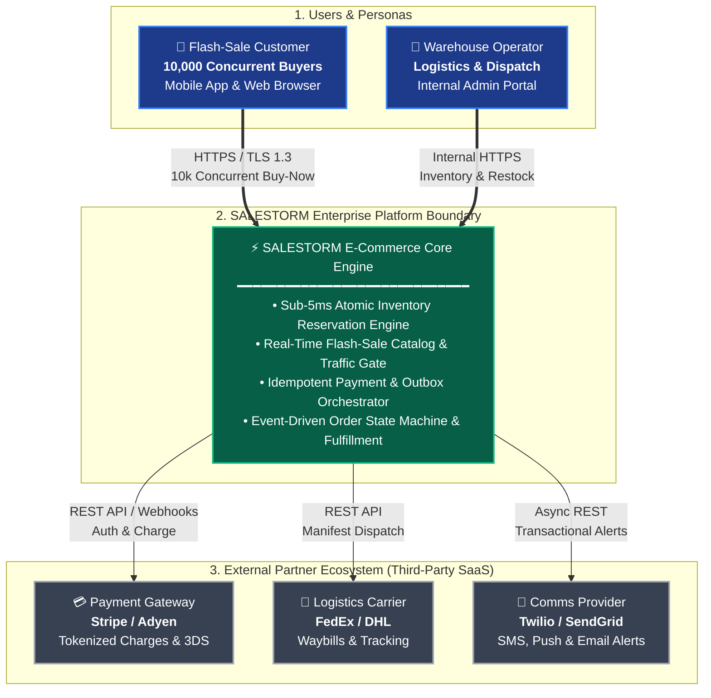
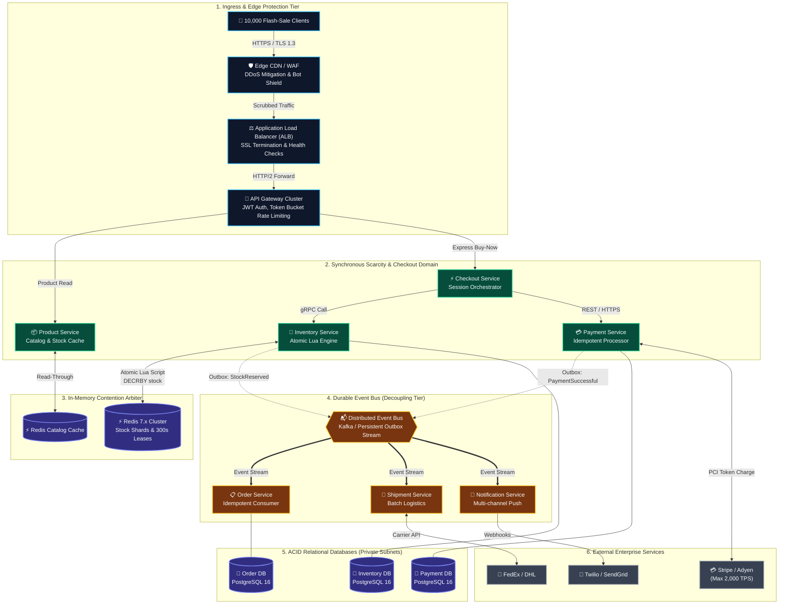
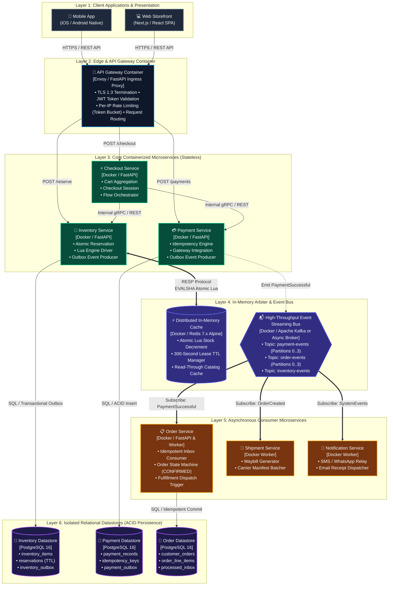
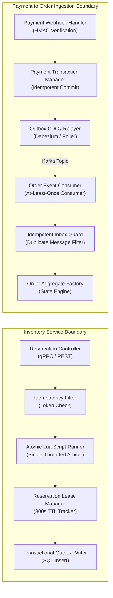
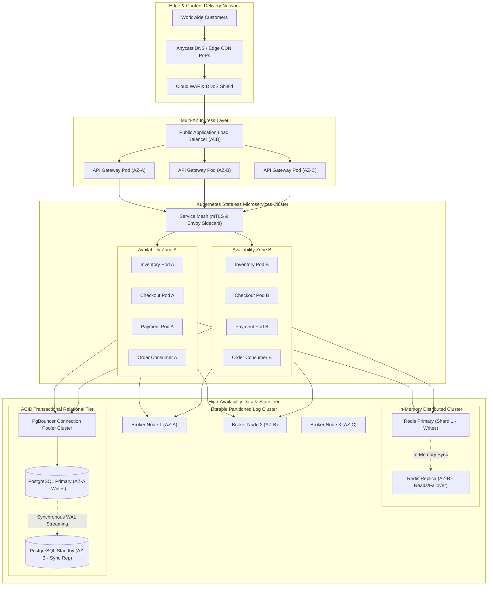
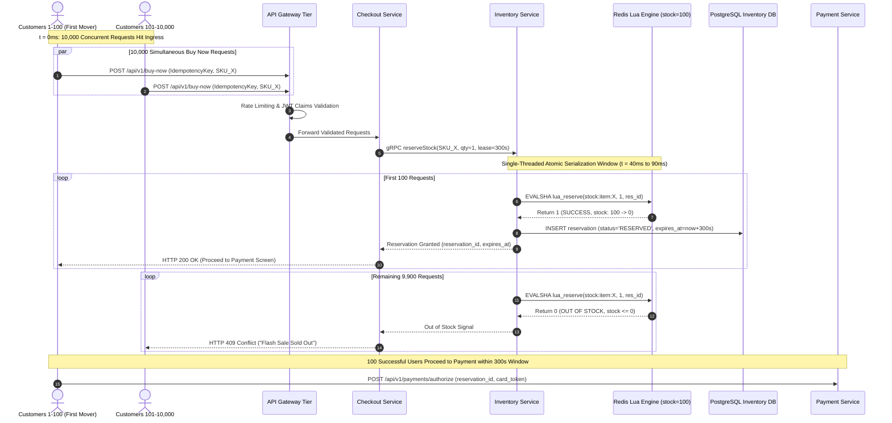
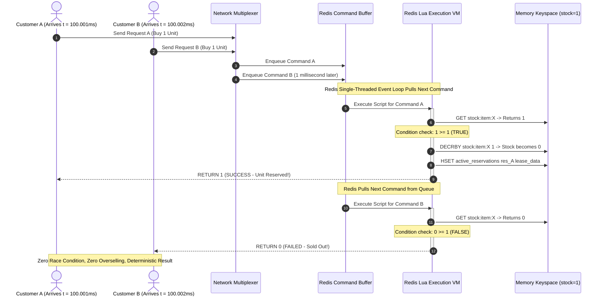
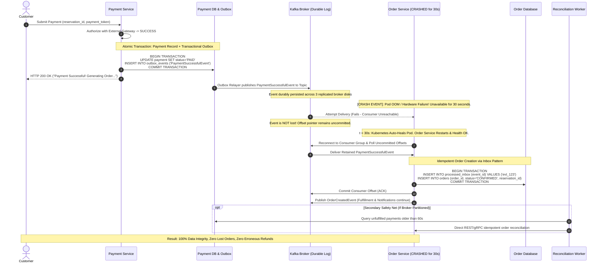

# SALESTORM — Official Architecture Diagrams Specification

**Document Version:** 1.0.0  
**Status:** Approved Architecture Baseline  
**Lead Author:** Member 1 (System Architect + Concurrency, Inventory & Scalability Lead)  
**Target Audience:** Core Engineering Team (Members 2, 3, 4), Technical Jury, Operations  

---

## Architectural Diagram Index

This document provides the canonical set of 8 system architecture diagrams required by the SALESTORM Hackathon Brief:

1. **[Diagram 1: System Context Diagram (C4 Level 1)](#diagram-1-system-context-diagram-c4-level-1)**
2. **[Diagram 2: High-Level Architecture Diagram](#diagram-2-high-level-architecture-diagram)**
3. **[Diagram 3: Container / Service Diagram (C4 Level 2)](#diagram-3-container--service-diagram-c4-level-2)**
4. **[Diagram 4: Component-Level Architecture for Critical Flow (C4 Level 3)](#diagram-4-component-level-architecture-for-critical-flow-c4-level-3)**
5. **[Diagram 5: Logical Deployment & Infrastructure Topology](#diagram-5-logical-deployment--infrastructure-topology)**
6. **[Diagram 6: High-Traffic Request Flow (10,000 Contenders)](#diagram-6-high-traffic-request-flow-10000-contenders)**
7. **[Diagram 7: Inventory Concurrency & Last-Unit Serialization](#diagram-7-inventory-concurrency--last-unit-serialization)**
8. **[Diagram 8: Failure Handling & Order Recovery Architecture](#diagram-8-failure-handling--order-recovery-architecture)**

---

## Diagram 1: System Context Diagram (C4 Level 1)

The System Context diagram illustrates how SALESTORM fits into its external environment, interacting with customers, warehouse operators, and third-party SaaS providers without line collisions or overlapping text.

---

## Diagram 2: High-Level Architecture Diagram

The High-Level Architecture depicts the overall logical system topology, showcasing ingress security, caching tiers, microservice boundaries, synchronous vs. asynchronous paths, and transactional storage.

---

## Diagram 3: Container / Service Diagram (C4 Level 2)

This diagram details the containerized microservices, their runtime communication protocols, and their private encapsulated datastores arranged in distinct, non-overlapping architectural layers.

---

## Diagram 4: Component-Level Architecture for Critical Flow (C4 Level 3)

Zooming inside the **Inventory Service** and **Payment-to-Order Pipeline** to highlight internal components, thread pools, and data boundaries.

---

## Diagram 5: Logical Deployment & Infrastructure Topology

This topology represents a cloud-agnostic, multi-Availability Zone (AZ) production deployment, structured specifically for Member 4 to map into AWS.

---

## Diagram 6: High-Traffic Request Flow (10,000 Contenders)

A comprehensive sequence walkthrough showing what happens when 10,000 users hit "Buy Now" at $t = 0$.

---

## Diagram 7: Inventory Concurrency & Last-Unit Serialization

The exact microscopic timeline demonstrating deterministic tie-breaking when two concurrent requests arrive for the final remaining unit ($N = 1$).

---

## Diagram 8: Failure Handling & Order Recovery Architecture

Demonstrating the exact architecture solving the critical test scenario: **Payment succeeds, but Order Service is crashed/unavailable for 30 seconds**.

---

*End of 03_Architecture_Diagrams.md — Authoritative Visual Architecture Specification.*
