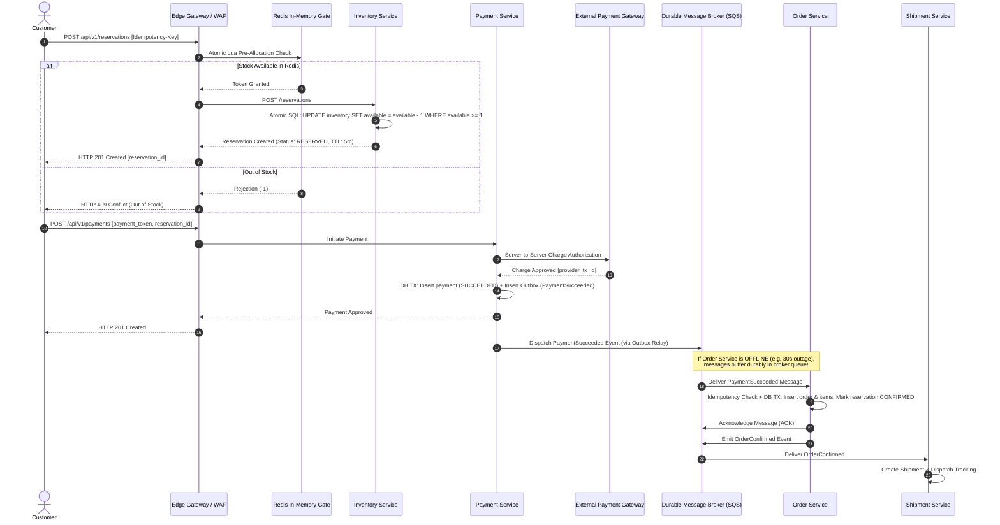

# SALESTORM 2026 | High-Level Data Flow & Service Integration Architecture

## 1. End-to-End System Data Flow

This document details the cross-service data flow, transactional boundaries, and event pipelines connecting Member 1's High-Level Architecture with Member 3's persistence, API, and event contracts.

---

## 2. Bounded Context Integration Contract

| Source Context | Target Context | Integration Pattern | Data Passed | Failure Handling |
| :--- | :--- | :--- | :--- | :--- |
| **Ingress Gateway** | **Inventory Service** | Synchronous REST | `product_id`, `quantity`, `idempotency_key` | Fail-fast with HTTP 409 Out of Stock. |
| **Checkout Frontend** | **Payment Service** | Synchronous REST | `reservation_id`, `token`, `amount` | Circuit breaker tripped on gateway timeout. |
| **Payment Service** | **Order Service** | Asynchronous Event (`PaymentSucceeded`) | `payment_id`, `reservation_id`, `amount`, `customer_id` | Buffered in durable queue; retried with exponential backoff. |
| **Order Service** | **Inventory Service** | Asynchronous Event (`OrderConfirmed`) | `reservation_id`, `product_id`, `quantity` | Converts held stock to permanently sold. |
| **Payment Service** | **Inventory Service** | Asynchronous Event (`PaymentFailed`) | `reservation_id`, `reason` | Releases held reservation back to available inventory. |
