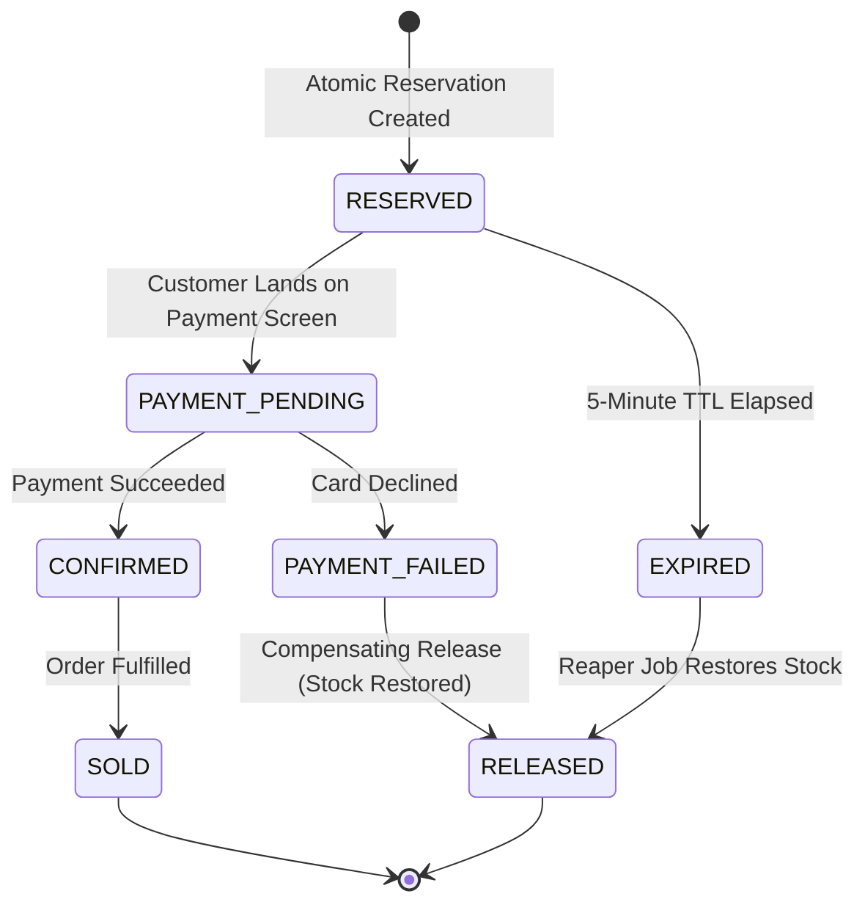
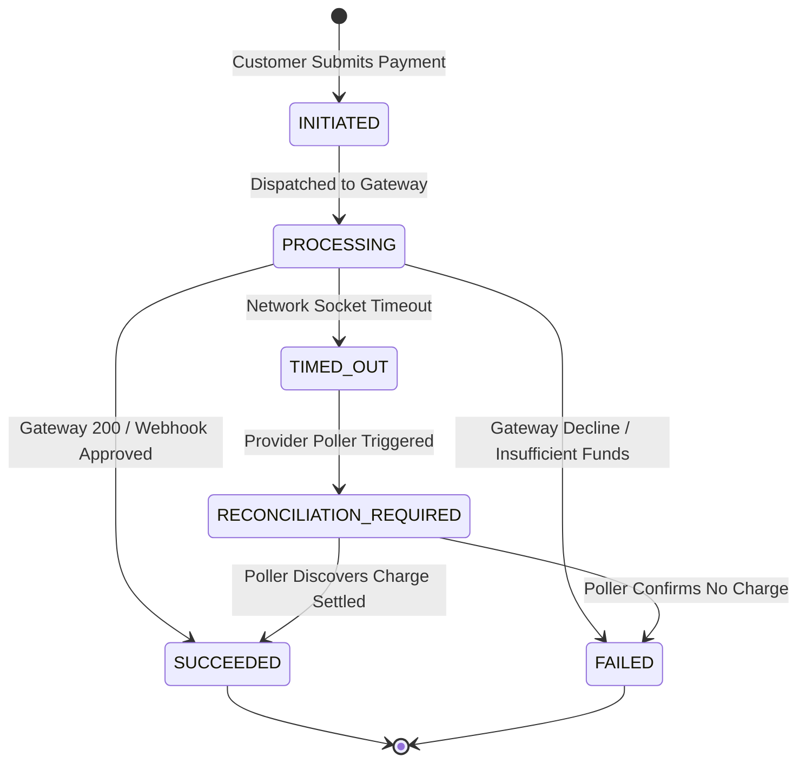
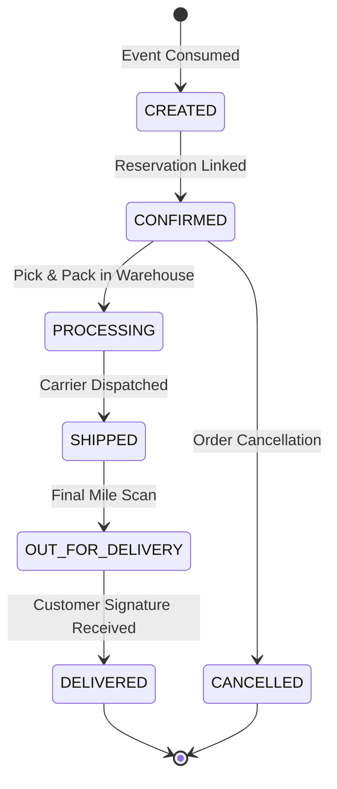

# SALESTORM 2026 | Low-Level Design (LLD) Class Contracts & Interfaces

## 1. Domain Interfaces & Repository Contracts

This document formalizes the object-oriented contracts, interfaces, and state machines established by Member 2 and implemented physically by Member 3.

```mermaid
classDiagram
    class IInventoryRepository {
        <<interface>>
        +reserveAtomic(productId: UUID, quantity: int, idempotencyKey: string): ReservationResult
        +releaseHold(reservationId: UUID, reason: string): boolean
        +confirmSale(reservationId: UUID): boolean
        +getSnapshot(productId: UUID): InventorySnapshot
    }

    class IPaymentGateway {
        <<interface>>
        +authorizeCharge(token: string, amount: Decimal, currency: string, idempotencyKey: string): PaymentGatewayResponse
        +verifyWebhookSignature(payload: string, signature: string, timestamp: long): boolean
        +queryTransactionStatus(providerTxId: string): PaymentGatewayResponse
    }

    class IOrderRepository {
        <<interface>>
        +createOrderFromReservation(reservationId: UUID, paymentId: UUID, address: Address): Order
        +getOrderById(orderId: UUID): Order
        +updateStatus(orderId: UUID, status: OrderStatus): void
    }

    class IIdempotencyStore {
        <<interface>>
        +acquireLock(key: string, scope: string, hash: string, ttl: Duration): LockStatus
        +recordResponse(key: string, code: int, body: string): void
        +getResponse(key: string): CachedResponse
    }

    class IEventPublisher {
        <<interface>>
        +publishToOutbox(event: CloudEvent): void
        +dispatchPendingEvents(): int
    }
```

---

## 2. Domain State Machines

### 2.1 Inventory Reservation State Machine

### 2.2 Payment State Machine

### 2.3 Order Lifecycle State Machine

