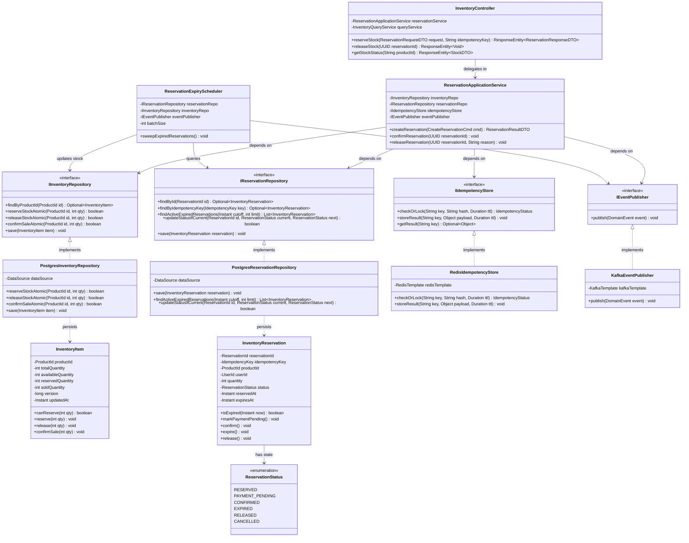

# Inventory & Reservation Service — Class Diagram

## 1. Class Structure & Object-Oriented Relationships

---

## 2. Key Responsibilities & Defensible Design Rationale

| Class / Interface | Domain Responsibility | Concurrency & Idempotency Role |
| :--- | :--- | :--- |
| `InventoryItem` | Enforces fundamental stock invariants ($total = available + reserved + sold$). | Domain-level guard checking whether $requestedQty \le available$. |
| `IInventoryRepository` | Persistence port abstracting relational database write serialization. | Executes **atomic conditional updates** in SQL: `UPDATE ... WHERE available_quantity >= :qty`. Zero application locks. |
| `InventoryReservation` | Encapsulates single reservation entity, timestamped expiration, and status transitions. | Tracks `expires_at` and `idempotency_key` binding. |
| `IIdempotencyStore` | Fast distributed key-value lock & result cache interface (Redis backed). | Deduplicates incoming client retries within a 15-minute sliding window. |
| `ReservationExpiryScheduler` | Proactive background daemon releasing abandoned reservations. | Uses CAS state transitions (`RESERVED` $\rightarrow$ `EXPIRED`) to prevent double-release race conditions. |
| `KafkaEventPublisher` | Asynchronous integration publisher. | Emits `InventoryReservedEvent` to trigger checkout and order workflows. |
