# Order Service — Class Diagram

## 1. Class Structure & Object-Oriented Relationships

```mermaid
classDiagram
    %% API & Event Consumer Layer
    class OrderController {
        -OrderApplicationService orderService
        -OrderQueryService queryService
        +getOrder(UUID orderId) ResponseEntity~OrderDTO~
        +cancelOrder(UUID orderId, String reason) ResponseEntity~Void~
    }

    class PaymentEventConsumer {
        -IdempotentEventProcessor eventProcessor
        +onPaymentSucceeded(String messagePayload, String messageId) void
        +onPaymentFailed(String messagePayload, String messageId) void
    }

    %% Application Layer
    class OrderApplicationService {
        -IOrderRepository orderRepository
        -IOutboxRepository outboxRepository
        +createOrderFromReservation(CreateOrderCmd cmd) OrderDTO
        +confirmOrder(UUID orderId, UUID paymentId) void
        +processFulfillment(UUID orderId) void
        +shipOrder(UUID orderId, String trackingNum) void
        +deliverOrder(UUID orderId) void
        +cancelOrder(UUID orderId, String reason) void
    }

    class IdempotentEventProcessor {
        -IProcessedEventRepository processedEventRepo
        -OrderApplicationService orderService
        +processEvent(DomainEventEnvelope envelope, ConsumerAction action) void
    }

    class TransactionalOutboxDispatcher {
        -IOutboxRepository outboxRepo
        -IMessagePublisher messagePublisher
        +dispatchPendingEvents() void
    }

    %% Domain Aggregates & Entities
    class Order {
        -OrderId id
        -CustomerId customerId
        -ReservationId reservationId
        -List~OrderItem~ items
        -ShippingAddress shippingAddress
        -Money totalAmount
        -IOrderState currentState
        -Instant createdAt
        -Instant updatedAt
        +markPaymentPending() void
        +confirmPayment(UUID paymentId) void
        +processFulfillment() void
        +ship(String trackingNumber) void
        +deliver() void
        +cancel(String reason) void
        +getStatus() OrderStatus
    }

    class OrderItem {
        -ProductId productId
        -int quantity
        -Money unitPrice
        -Money subtotal
        +calculateSubtotal() Money
    }

    %% State Pattern for Order Lifecycle
    class IOrderState {
        <<interface>>
        +getStatus() OrderStatus
        +transitionTo(Order order, OrderStatus target) IOrderState
    }

    class CreatedState {
        +getStatus() OrderStatus
        +transitionTo(Order order, OrderStatus target) IOrderState
    }

    class PaymentPendingState {
        +getStatus() OrderStatus
        +transitionTo(Order order, OrderStatus target) IOrderState
    }

    class ConfirmedState {
        +getStatus() OrderStatus
        +transitionTo(Order order, OrderStatus target) IOrderState
    }

    class ProcessingState {
        +getStatus() OrderStatus
        +transitionTo(Order order, OrderStatus target) IOrderState
    }

    class ShippedState {
        +getStatus() OrderStatus
        +transitionTo(Order order, OrderStatus target) IOrderState
    }

    class DeliveredState {
        +getStatus() OrderStatus
        +transitionTo(Order order, OrderStatus target) IOrderState
    }

    class CancelledState {
        +getStatus() OrderStatus
        +transitionTo(Order order, OrderStatus target) IOrderState
    }

    class OrderStatus {
        <<enumeration>>
        CREATED
        PAYMENT_PENDING
        CONFIRMED
        PROCESSING
        SHIPPED
        OUT_FOR_DELIVERY
        DELIVERED
        CANCELLED
    }

    %% Ports / SPI Interfaces
    class IOrderRepository {
        <<interface>>
        +findById(OrderId id) Optional~Order~
        +findByReservationId(ReservationId id) Optional~Order~
        +save(Order order) void
    }

    class IProcessedEventRepository {
        <<interface>>
        +tryRecordProcessedEvent(String eventId, String eventType, Instant now) boolean
    }

    class IOutboxRepository {
        <<interface>>
        +saveEvent(OutboxRecord record) void
        +fetchUnsentEvents(int batchSize) List~OutboxRecord~
        +markSent(List~UUID~ eventIds) void
    }

    class IMessagePublisher {
        <<interface>>
        +publish(String topic, String key, String payload) void
    }

    %% Infrastructure Adapters
    class PostgresOrderRepository {
        -DataSource dataSource
        +findById(OrderId id) Optional~Order~
        +save(Order order) void
    }

    class PostgresProcessedEventRepository {
        -DataSource dataSource
        +tryRecordProcessedEvent(String eventId, String eventType, Instant now) boolean
    }

    class PostgresOutboxRepository {
        -DataSource dataSource
        +saveEvent(OutboxRecord record) void
        +fetchUnsentEvents(int limit) List~OutboxRecord~
        +markSent(List~UUID~ ids) void
    }

    class KafkaMessagePublisher {
        -KafkaTemplate kafkaTemplate
        +publish(String topic, String key, String payload) void
    }

    %% Relationships
    OrderController --> OrderApplicationService : uses
    PaymentEventConsumer --> IdempotentEventProcessor : delegates to
    IdempotentEventProcessor --> IProcessedEventRepository : checks uniqueness
    IdempotentEventProcessor --> OrderApplicationService : invokes
    OrderApplicationService --> IOrderRepository : persists Order
    OrderApplicationService --> IOutboxRepository : writes outbox

    TransactionalOutboxDispatcher --> IOutboxRepository : polls unsent
    TransactionalOutboxDispatcher --> IMessagePublisher : emits

    Order --> OrderItem : contains
    Order *-- IOrderState : uses State Pattern
    IOrderState <|.. CreatedState : implements
    IOrderState <|.. PaymentPendingState : implements
    IOrderState <|.. ConfirmedState : implements
    IOrderState <|.. ProcessingState : implements
    IOrderState <|.. ShippedState : implements
    IOrderState <|.. DeliveredState : implements
    IOrderState <|.. CancelledState : implements

    IOrderRepository <|.. PostgresOrderRepository : implements
    IProcessedEventRepository <|.. PostgresProcessedEventRepository : implements
    IOutboxRepository <|.. PostgresOutboxRepository : implements
    IMessagePublisher <|.. KafkaMessagePublisher : implements
```

---

## 2. Key Responsibilities & Defensible Design Rationale

| Class / Component | Domain & Behavioral Responsibility | Pattern / Reliability Role |
| :--- | :--- | :--- |
| `Order` | Aggregate Root preserving item integrity, monetary calculations, and lifecycle progression. | Root entity for order transaction boundaries. |
| `IOrderState` & Concrete States | **State Pattern:** Encapsulates state-specific transition rules and invariants. | Guarantees invalid transitions (e.g. `CREATED` $\rightarrow$ `DELIVERED`) are rejected before touching persistence. |
| `IdempotentEventProcessor` | Transactional event deduplication engine. | Uses `IProcessedEventRepository.tryRecordProcessedEvent()` to atomically ignore duplicate Kafka deliveries. |
| `TransactionalOutboxDispatcher` | **Transactional Outbox Pattern:** Ensures dual-write safety. | Order DB update and `outbox_events` insert occur in the *same local SQL transaction*, guaranteeing zero message loss even if broker is down. |
