# Payment Service — Class Diagram

## 1. Class Structure & Object-Oriented Relationships

```mermaid
classDiagram
    %% Presentation / Controller Layer
    class PaymentController {
        -PaymentApplicationService paymentService
        +initiatePayment(PaymentRequestDTO request, String idempotencyKey) ResponseEntity~PaymentResponseDTO~
        +getPaymentStatus(UUID transactionId) ResponseEntity~PaymentStatusDTO~
    }

    class PaymentWebhookController {
        -PaymentWebhookService webhookService
        +handleStripeWebhook(String signature, String payload) ResponseEntity~Void~
        +handlePayPalWebhook(String signature, String payload) ResponseEntity~Void~
    }

    %% Application Layer
    class PaymentApplicationService {
        -IPaymentProviderFactory providerFactory
        -IPaymentRepository paymentRepository
        -IIdempotencyStore idempotencyStore
        -ICircuitBreaker circuitBreaker
        -IEventPublisher eventPublisher
        +processPayment(ProcessPaymentCmd cmd) PaymentResultDTO
        +queryStatus(UUID transactionId) PaymentResultDTO
    }

    class PaymentReconciliationService {
        -IPaymentRepository paymentRepository
        -IPaymentProviderFactory providerFactory
        -IEventPublisher eventPublisher
        +reconcilePendingPayments() void
    }

    %% Domain Aggregates & Value Objects
    class PaymentTransaction {
        -PaymentTransactionId id
        -IdempotencyKey idempotencyKey
        -OrderId orderId
        -ReservationId reservationId
        -CustomerId customerId
        -Money amount
        -PaymentProviderType providerType
        -String providerReferenceId
        -PaymentStatus status
        -int retryCount
        -Instant createdAt
        -Instant completedAt
        +markInitiated(String refId) void
        +markSuccess(String refId, Instant completedAt) void
        +markFailed(String reason) void
        +markPendingVerification(String reason) void
        +canRetry() boolean
    }

    class Money {
        -BigDecimal amount
        -Currency currency
        +add(Money other) Money
        +isGreaterThan(Money other) boolean
    }

    class PaymentStatus {
        <<enumeration>>
        INITIATED
        PENDING_VERIFICATION
        SUCCESS
        FAILED
        CANCELLED
        REFUNDED
    }

    class PaymentProviderType {
        <<enumeration>>
        STRIPE
        PAYPAL
        UPI
        RAZORPAY
    }

    %% Ports / SPI Interfaces
    class IPaymentProviderAdapter {
        <<interface>>
        +getProviderType() PaymentProviderType
        +processPayment(GatewayChargeRequest request) GatewayChargeResult
        +queryPaymentStatus(String providerRef, String idempotencyKey) GatewayStatusResult
        +refundPayment(GatewayRefundRequest request) GatewayRefundResult
    }

    class IPaymentProviderFactory {
        <<interface>>
        +getProvider(PaymentProviderType type) IPaymentProviderAdapter
    }

    class IPaymentRepository {
        <<interface>>
        +findById(PaymentTransactionId id) Optional~PaymentTransaction~
        +findByIdempotencyKey(IdempotencyKey key) Optional~PaymentTransaction~
        +findByProviderReferenceId(String refId) Optional~PaymentTransaction~
        +findPendingVerification(Instant cutoff, int limit) List~PaymentTransaction~
        +save(PaymentTransaction transaction) void
    }

    class ICircuitBreaker {
        <<interface>>
        +execute(Supplier action, Supplier fallback) Object
        +getState() CircuitBreakerState
    }

    class IEventPublisher {
        <<interface>>
        +publish(DomainEvent event) void
    }

    %% Concrete Adapters (Infrastructure)
    class StripePaymentAdapter {
        -StripeHttpClient client
        -String apiKey
        +processPayment(GatewayChargeRequest req) GatewayChargeResult
        +queryPaymentStatus(String ref, String idemKey) GatewayStatusResult
        +refundPayment(GatewayRefundRequest req) GatewayRefundResult
    }

    class PayPalPaymentAdapter {
        -PayPalHttpClient client
        -String clientId
        +processPayment(GatewayChargeRequest req) GatewayChargeResult
        +queryPaymentStatus(String ref, String idemKey) GatewayStatusResult
        +refundPayment(GatewayRefundRequest req) GatewayRefundResult
    }

    class DefaultPaymentProviderFactory {
        -Map~PaymentProviderType, IPaymentProviderAdapter~ providers
        +getProvider(PaymentProviderType type) IPaymentProviderAdapter
    }

    class Resilience4jCircuitBreakerAdapter {
        -CircuitBreaker registry
        +execute(Supplier action, Supplier fallback) Object
    }

    class PostgresPaymentRepository {
        -DataSource dataSource
        +findById(PaymentTransactionId id) Optional~PaymentTransaction~
        +save(PaymentTransaction transaction) void
    }

    class KafkaPaymentEventPublisher {
        -KafkaTemplate kafkaTemplate
        +publish(DomainEvent event) void
    }

    %% Relationships
    PaymentController --> PaymentApplicationService : delegates to
    PaymentApplicationService --> IPaymentProviderFactory : uses
    PaymentApplicationService --> IPaymentRepository : persists via
    PaymentApplicationService --> ICircuitBreaker : wraps provider calls with
    PaymentApplicationService --> IEventPublisher : publishes events

    PaymentReconciliationService --> IPaymentRepository : queries pending
    PaymentReconciliationService --> IPaymentProviderFactory : queries gateway status
    PaymentReconciliationService --> IEventPublisher : emits resolved events

    DefaultPaymentProviderFactory ..|> IPaymentProviderFactory : implements
    DefaultPaymentProviderFactory --> IPaymentProviderAdapter : manages registry of

    StripePaymentAdapter ..|> IPaymentProviderAdapter : implements (Adapter Pattern)
    PayPalPaymentAdapter ..|> IPaymentProviderAdapter : implements (Adapter Pattern)
    Resilience4jCircuitBreakerAdapter ..|> ICircuitBreaker : implements
    PostgresPaymentRepository ..|> IPaymentRepository : implements
    KafkaPaymentEventPublisher ..|> IEventPublisher : implements

    PaymentTransaction --> PaymentStatus : has
    PaymentTransaction --> PaymentProviderType : has
    PaymentTransaction --> Money : has amount
```

---

## 2. Key Responsibilities & Defensible Design Rationale

| Component | Responsibility & Pattern Role | Failure & Idempotency Behavior |
| :--- | :--- | :--- |
| `IPaymentProviderAdapter` | **Adapter & Strategy Pattern Interface:** Standardizes heterogeneous gateway APIs into unified domain operations. | Isolates domain from third-party SDK quirks, XML/JSON formats, and error codes. |
| `DefaultPaymentProviderFactory` | **Factory Pattern:** Dynamically routes charges to the appropriate adapter based on `PaymentProviderType`. | Enables adding new payment methods (e.g., Apple Pay, Klarna) without modifying `PaymentApplicationService` (**Open/Closed Principle**). |
| `ICircuitBreaker` | **Circuit Breaker Pattern:** Detects recurring HTTP 5xx errors or timeouts from upstream PSPs. | Trips to `OPEN` state after failure threshold, failing fast and preventing connection pool starvation. |
| `PaymentReconciliationService` | Asynchronous reconciler for `PENDING_VERIFICATION` transactions. | Queries external provider status safely using `providerReferenceId` or `idempotencyKey` before marking `SUCCESS` or `FAILED`. Prevents double charges. |
| `PaymentTransaction` | Domain Aggregate Root tracking financial states and retry counts. | Protects transaction invariants; rejects duplicate state transitions. |
