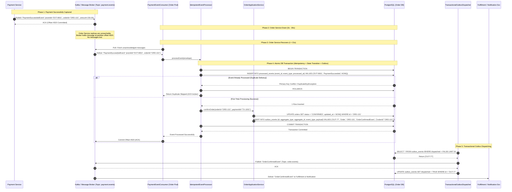

# Order Creation & 30-Second Outage Recovery Sequence Diagram

## 1. Failure & Recovery Scenario: Payment Success with Order Service Unavailable for 30 Seconds

This sequence diagram depicts the resilient recovery flow when payment succeeds, but the Order Service is down for 30 seconds. It shows broker retention, consumer reconnection, atomic transactional deduplication, and transactional outbox dispatch.

---

## 2. Key Resilience & Correctness Guarantees

1. **At-Least-Once Broker Delivery $\rightarrow$ Exactly-Once Business Outcome:**
   - The message broker retains messages during service outages.
   - Dedup table `processed_events` in the Order database ensures redelivered messages are safely ignored.
2. **Transactional Outbox Pattern (Dual-Write Solution):**
   - The state transition (`orders.status = CONFIRMED`) and the outbound event (`outbox_events`) are committed in the **same local database transaction**.
   - If the system crashes after committing to the database but before publishing to Kafka, the `TransactionalOutboxDispatcher` picks up the pending row upon restart and publishes it.
