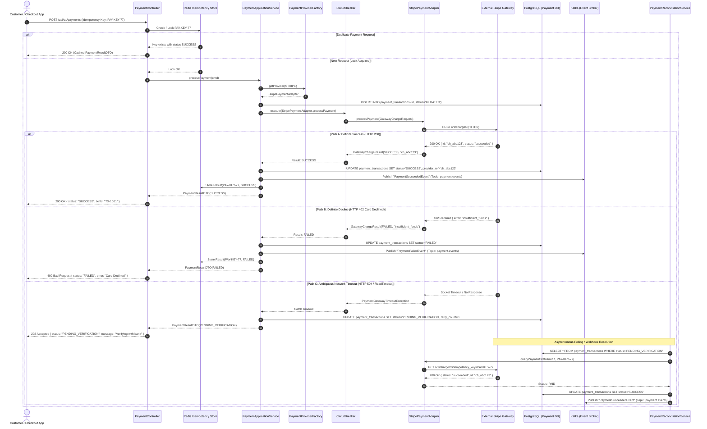

# Payment Sequence Diagram

## 1. Complete Workflow: Success, Gateway Failure, Ambiguous Timeout & Reconciliation

This sequence diagram illustrates the lifecycle of a payment request across synchronous processing, provider adapter routing, circuit breaker protection, ambiguous timeout isolation, and asynchronous reconciliation.

---

## 2. Key Reliability Design Elements

1. **Strict Prevention of Double Charges:**
   - Under timeout conditions (Path C), the service **never blind-retries a charge request**.
   - Instead, it marks the transaction `PENDING_VERIFICATION` and relies on `queryPaymentStatus()` using the original `Idempotency-Key`.
2. **Circuit Breaker Shielding:**
   - If Stripe fails 50% of requests in a sliding window, `CircuitBreaker` opens, instantly failing fast without tying up server threads.
3. **Decoupled Event Notification:**
   - On verified success, `PaymentSucceededEvent` is published to Kafka, guaranteeing downstream Order confirmation and Inventory finalization.
