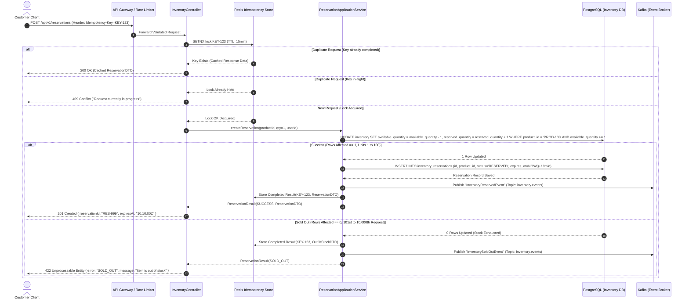

# Purchase & Reservation Sequence Diagram

## 1. Concurrency Scenario: 10,000 Concurrent Requests for 100 Units

This sequence diagram depicts what happens when 10,000 clients simultaneously trigger "Buy Now". It shows the exact flow through API Gateway, Idempotency Guard, Atomic SQL Contention, Reservation Creation, and Alternative Branches (Success, Sold Out, Duplicate Request).

---

## 2. Key Decision Points & Invariants Verified

1. **Deterministic Concurrency Serialization:**
   - The database engine serializes write locks on the single `inventory` row for `PROD-100`.
   - The conditional predicate `AND available_quantity >= 1` is evaluated inside the engine's row lock.
   - Exactly **100 requests** receive `rows_affected = 1` and proceed to create reservations.
   - The remaining **9,900 requests** receive `rows_affected = 0` and are immediately returned as Sold Out without data corruption.

2. **Idempotency Protection:**
   - If a customer double-clicks "Buy Now" or the network drops the first response, the second request encounters `SETNX lock:KEY-123` $\rightarrow$ returns existing result without decrementing inventory twice.

3. **Temporary Hold Security:**
   - Active reservations are stamped with `expires_at = NOW() + 10min`. If not confirmed by payment, the `ReservationExpiryScheduler` safely returns the unit to `available_quantity`.
