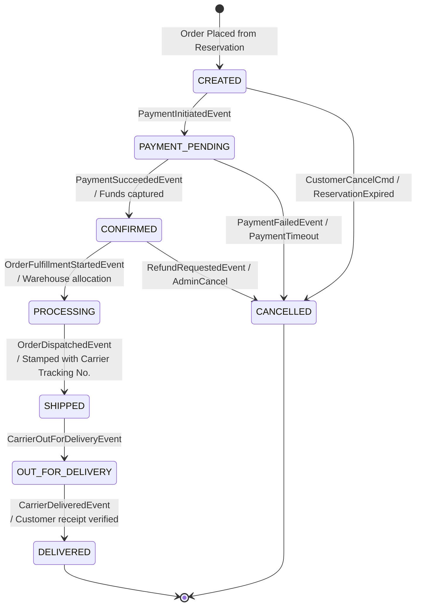

# Order Lifecycle — State Diagram

## 1. Formal State Machine Definition

The **Order Lifecycle** models the progression of an order from initial creation to final delivery. State transitions are strictly enforced via the **State Pattern** (`IOrderState`), rejecting any out-of-order execution.

---

## 2. Transition Guard Matrix & Invalid Path Rejections

| Source State | Target State | Permitted? | Triggering Event / Command | Domain Guard / Validation |
| :--- | :--- | :---: | :--- | :--- |
| `CREATED` | `PAYMENT_PENDING` | ✅ Yes | `PaymentInitiatedEvent` | Verifies active reservation lock exists. |
| `CREATED` | `CONFIRMED` | ❌ No | — | Throws `InvalidOrderStateTransitionException` (Payment must be initiated first). |
| `CREATED` | `DELIVERED` | ❌ No | — | Throws `InvalidOrderStateTransitionException`. |
| `PAYMENT_PENDING` | `CONFIRMED` | ✅ Yes | `PaymentSucceededEvent` | Matches verified payment transaction ID. |
| `PAYMENT_PENDING` | `CANCELLED` | ✅ Yes | `PaymentFailedEvent` | Emits `OrderCancelledEvent` to trigger inventory release. |
| `CONFIRMED` | `PROCESSING` | ✅ Yes | `StartFulfillmentCmd` | Verifies warehouse allocation status. |
| `PROCESSING` | `SHIPPED` | ✅ Yes | `DispatchOrderCmd` | Requires non-null `TrackingNumber`. |
| `SHIPPED` | `DELIVERED` | ⚠️ Direct Jump | `CarrierDeliveredEvent` | Permitted directly if carrier skips intermediate status. |
| `DELIVERED` | `CANCELLED` | ❌ No | — | Strict Domain Invariant: Completed delivery cannot be cancelled (requires separate RMA / Return workflow). |
