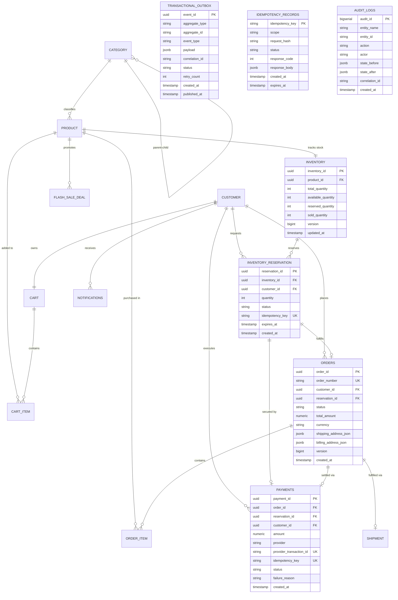

# SALESTORM 2026 | Entity-Relationship (ER) Architecture

## 1. Executive Summary & Design Principles

The SALESTORM database architecture is designed to handle extreme burst concurrency (500,000 req/sec flash sale peak) while enforcing mathematical guarantees against inventory overselling. The data model decouples high-contention, low-latency reservation primitives from asynchronous, eventual-consistency business operations (Order Confirmation, Shipment, Notification).

### Key Architectural Boundaries:
1. **Inventory Domain**: Owns strict consistency, atomic decrement operations, and temporary hold states (`AVAILABLE`, `RESERVED`, `SOLD`).
2. **Checkout & Reservation Domain**: Manages short-lived customer holds with strict TTL expiration and idempotency protection.
3. **Payment Domain**: Tracks financial state transitions (`INITIATED`, `PROCESSING`, `SUCCEEDED`, `FAILED`, `TIMED_OUT`, `RECONCILIATION_REQUIRED`) without blocking inventory rows.
4. **Order Domain**: Event-driven orchestration created asynchronously upon `PaymentSucceeded` confirmation via Transactional Outbox pattern.
5. **Auditing & Outbox**: Append-only ledgers providing at-least-once asynchronous messaging and tamper-evident audit logs.

---

## 2. Mermaid Entity-Relationship Diagram

---

## 3. Core Entities Overview

| Entity Name | Primary Key | Domain Ownership | Invariant / Boundary Rule |
| :--- | :--- | :--- | :--- |
| **`categories`** | `category_id` (UUID) | Catalog | Hierarchical tree with parent-child relationship. |
| **`customers`** | `customer_id` (UUID) | User / Identity | Unique verified email; customer context for reservations & orders. |
| **`products`** | `product_id` (UUID) | Catalog | Single source of truth for SKU, catalog metadata, base pricing. |
| **`inventory`** | `inventory_id` (UUID) | Inventory Control | `available_quantity + reserved_quantity + sold_quantity = total_quantity`. Check constraints guarantee `available_quantity >= 0`. |
| **`inventory_reservations`** | `reservation_id` (UUID) | Reservation Engine | Short-lived TTL locks (e.g. 5 minutes). Transition states: `RESERVED` -> `PAYMENT_PENDING` -> `CONFIRMED` / `RELEASED`. |
| **`flash_sale_deals`** | `deal_id` (UUID) | Promotions | Time-bounded flash sale windows (`ends_at > starts_at`) with quota allocation. |
| **`carts` & `cart_items`**| `cart_id` (UUID) | Pre-checkout | Transient shopping cart before flash-sale reservation. |
| **`orders` & `order_items`**| `order_id` (UUID) | Order Management | Immutable snapshot of purchased items, prices, shipping addresses; links 1-to-1 with reservation. |
| **`payments`** | `payment_id` (UUID) | Financial Settlement | Idempotent transaction tracking external payment provider webhooks; supports ambiguous timeouts. |
| **`shipments`** | `shipment_id` (UUID) | Logistics | Carrier tracking and delivery lifecycle transitions. |
| **`notifications`** | `notification_id` (UUID)| Communications | Multi-channel async dispatch tracking (Email, SMS, Push). |
| **`idempotency_records`**| `idempotency_key` (VARCHAR)| Reliability | Distributed request deduplication store with SHA-256 payload fingerprinting. |
| **`transactional_outbox`**| `event_id` (UUID) | Messaging Core | Local transactional outbox ensuring atomic DB state + event publication (dual-write prevention). |
| **`audit_logs`** | `audit_id` (BIGSERIAL)| Security / Compliance| Immutable append-only audit trail capturing state delta and actor correlation IDs. |

---

## 4. Cross-Service Boundaries & Referential Integrity

In a high-scale distributed microservices topology (as planned by Member 1 and implemented on AWS by Member 4), synchronous foreign keys between distinct bounded contexts create coupling and availability bottlenecks.

1. **Intra-Service (Strong Referential Integrity)**:
   - `inventory` -> `products` (Enforced via SQL Foreign Key `ON DELETE RESTRICT`)
   - `orders` -> `order_items` (Enforced via SQL Foreign Key `ON DELETE CASCADE`)
   - `carts` -> `cart_items` (Enforced via SQL Foreign Key `ON DELETE CASCADE`)

2. **Inter-Service (Logical References & Eventual Consistency)**:
   - `orders` -> `inventory_reservations`: In a decoupled service database setup, `reservation_id` is maintained as a logical UUID reference. When sharing a consolidated database cluster during the hackathon prototype, a foreign key is maintained to guarantee zero orphan records.
   - `payments` -> `orders`: Payments are linked to reservations first, because payment occurs before or during final order entity commitment. `order_id` is nullable during payment initiation and populated upon order generation.
