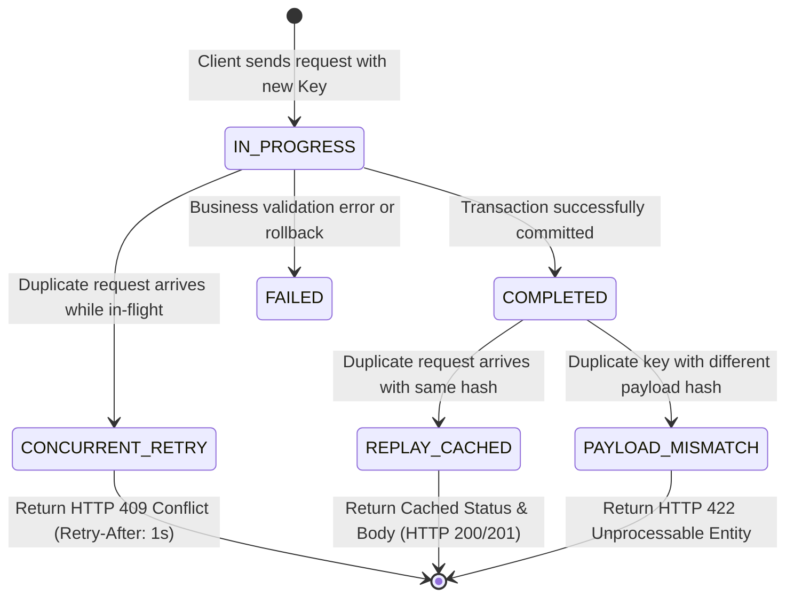

# SALESTORM 2026 | Database Idempotency Model & Deduplication Engine

## 1. The Three Tiers of Idempotency

In distributed systems, network unreliability causes clients to retry requests when timeouts occur. Under flash-sale pressure, 2% of incoming traffic represents duplicate requests.

SALESTORM strictly delineates **three independent idempotency layers**:

```
                       [ Incoming Client Request ]
                                    │
                                    ▼
┌────────────────────────────────────────────────────────────────────────┐
│ TIER 1: HTTP API IDEMPOTENCY                                           │
│ Scope: API Gateway & Service Ingress                                   │
│ Target: Prevent duplicate HTTP POST /reservations or POST /payments    │
│ Mechanism: `Idempotency-Key` Header + SHA-256 Body Fingerprint         │
└────────────────────────────────────────────────────────────────────────┘
                                    │
                                    ▼
┌────────────────────────────────────────────────────────────────────────┐
│ TIER 2: FINANCIAL TRANSACTION IDEMPOTENCY                              │
│ Scope: Payment Service & Payment Gateway Provider                      │
│ Target: Prevent double credit card charges or duplicate bank debits    │
│ Mechanism: Provider Transaction Token + DB Unique Constraint           │
└────────────────────────────────────────────────────────────────────────┘
                                    │
                                    ▼
┌────────────────────────────────────────────────────────────────────────┐
│ TIER 3: MESSAGE-CONSUMER IDEMPOTENCY                                   │
│ Scope: Event Queue Consumers (Order, Shipment, Notifications)          │
│ Target: Handle At-Least-Once message delivery safely                   │
│ Mechanism: CloudEvents `event_id` deduplication table                  │
└────────────────────────────────────────────────────────────────────────┘
```

---

## 2. Idempotency State Machine & Database Protocol

The `idempotency_records` table acts as a distributed lock and response cache:



---

## 3. Database Execution Logic for Idempotent APIs

```sql
-- Step 1: Attempt to acquire the idempotency lock
INSERT INTO idempotency_records (
    idempotency_key,
    scope,
    request_hash,
    status,
    created_at,
    expires_at
) VALUES (
    :idempotencyKey,
    :scope,
    :sha256PayloadHash,
    'IN_PROGRESS',
    CURRENT_TIMESTAMP,
    CURRENT_TIMESTAMP + INTERVAL '24 hours'
)
ON CONFLICT (idempotency_key) DO NOTHING;

-- Step 2: Check if lock was acquired
-- If Rows Affected == 0, another request has already claimed this key!
SELECT status, request_hash, response_code, response_body 
FROM idempotency_records 
WHERE idempotency_key = :idempotencyKey;
```

### Handler Decision Matrix:
1. **Lock Acquired (New Request)**: Proceed with business transaction. On completion, update row:
   ```sql
   UPDATE idempotency_records
   SET status = 'COMPLETED',
       response_code = 201,
       response_body = :responseJson
   WHERE idempotency_key = :idempotencyKey;
   ```
2. **Key Exists, Status = `IN_PROGRESS`**: A concurrent thread is currently processing this request. Return **`HTTP 409 Conflict`** with header `Retry-After: 1`.
3. **Key Exists, Status = `COMPLETED`, Matching Hash**: Return the cached `response_code` and `response_body` (e.g. **`HTTP 200 OK`** or **`HTTP 201 Created`**). The duplicate operation is discarded without touching business rows!
4. **Key Exists, Payload Hash Does NOT Match**: Client is reusing an idempotency key for a different request payload. Return **`HTTP 422 Unprocessable Entity`** (or **`HTTP 400 Bad Request`**) with error code `IDEMPOTENCY_KEY_REUSE_MISMATCH`.

---

## 4. Message Consumer Deduplication Protocol

For asynchronous message consumers (e.g., Order Service consuming `PaymentSucceeded`):

```sql
BEGIN;

-- Check and insert consumer deduplication token
INSERT INTO idempotency_records (
    idempotency_key, 
    scope, 
    request_hash, 
    status, 
    expires_at
) VALUES (
    :eventId, 
    'CONSUMER:ORDER_SERVICE', 
    :sha256MessageHash, 
    'IN_PROGRESS', 
    NOW() + INTERVAL '7 days'
)
ON CONFLICT (idempotency_key) DO NOTHING;

-- If rows affected == 0, this event was already processed or is currently being processed
-- The consumer immediately acknowledges the message to SQS/Kafka and exits!
```

---

## 5. TTL and Automated Cleanup Strategy

Idempotency records have a strict **24-hour TTL** for HTTP APIs and a **7-day TTL** for async message consumers. Retaining records indefinitely causes index bloat.

### Automated Reaper Job:
```sql
-- Scheduled via pg_cron or AWS Lambda Every Hour
DELETE FROM idempotency_records 
WHERE expires_at < CURRENT_TIMESTAMP 
LIMIT 5000;
```
Supported by the partial index:
`CREATE INDEX idx_idempotency_expires_at ON idempotency_records(expires_at);`
Ensuring deletion operates in <50ms without table-wide lock escalation.
