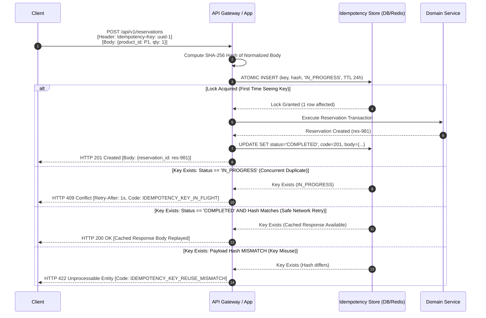

# SALESTORM 2026 | HTTP API Idempotency Protocol

## 1. Specification Overview

During high-concurrency flash sales, mobile clients and browsers frequently retry POST requests when network latency causes connection timeouts. Without strict API idempotency, network retries result in duplicate reservations, multiple credit card charges, and duplicate orders.

SALESTORM adopts the **IETF Draft: The Idempotency-Key HTTP Header Field**.

---

## 2. Idempotency Flow Protocol

---

## 3. Client Header Guidelines

1. **Header Name**: `Idempotency-Key` (Case-insensitive per HTTP/1.1 and HTTP/2).
2. **Format**: Standard UUID v4 (e.g., `8f9b2d8e-3a1b-4f9e-9d2a-1c8f3b4e5a6d`) or cryptographic random string (min 16 chars, max 128 chars).
3. **Scope**: Idempotency keys are scoped to the authenticated customer ID and target endpoint (`customer_id + method + path + key`). A customer cannot collide with another customer's key.
4. **Retention**: Keys are held for **24 hours**. Clients retrying after 24 hours are treated as issuing a new request.
