# SALESTORM — Official AWS Docker Deployment & Hosting Architecture

**Document Version:** 1.0.0  
**Target Cloud:** Amazon Web Services (AWS)  
**Primary Region:** `ap-south-1` (Asia Pacific - Mumbai)  
**Architecture Lead:** Member 4 (Security, Observability, DevOps & Cloud Lead)  
**Audience:** Core Engineering Team, Hackathon Jury, DevOps Reviewers  

---

## 1. Official Cloud Architecture Graphic


---

## 2. Complete End-to-End AWS Docker Architecture Diagram

```mermaid
flowchart TB
    %% ─────────────────────────────────────────────────────────────
    %% LAYER 0: GLOBAL CLIENT TRAFFIC & EXTERNAL PARTNERS
    %% ─────────────────────────────────────────────────────────────
    subgraph Clients ["👥 1. Global User Ingress Tier"]
        direction LR
        MobileUsers["📱 Mobile App Users<br/>(iOS / Android Native)"]
        WebUsers["💻 Web Storefront Users<br/>(Next.js / React SPA)"]
        BotContenders["⚡ 10,000 Flash-Sale Contenders<br/>(High-Concurrency Burst at t=0)"]
    end

    %% ─────────────────────────────────────────────────────────────
    %% LAYER 1: AWS EDGE NETWORK & PERIMETER SECURITY
    %% ─────────────────────────────────────────────────────────────
    subgraph EdgeLayer ["🌐 2. AWS Edge & Perimeter Protection Tier (Global Network)"]
        Route53["🌍 Amazon Route 53<br/>• Anycast DNS Resolution<br/>• Latency-Based Routing<br/>• Health Check Failover"]
        CloudFront["⚡ Amazon CloudFront (CDN Edge PoPs)<br/>• Static Asset Caching (Edge PoPs)<br/>• TLS 1.3 Termination<br/>• Gzip / Brotli Compression"]
        WAF["🛡️ AWS WAF (Web Application Firewall)<br/>• AWSManagedRulesCommonRuleSet<br/>• Rate-Based Rule: 2,000 req / 5 min per IP<br/>• Bot Control & Anti-DDoS Mitigation"]
        ACM["🔒 AWS Certificate Manager (ACM)<br/>• Wildcard SSL/TLS Certificate<br/>• Auto-Renewal (*.salestorm.io)"]
    end

    %% ─────────────────────────────────────────────────────────────
    %% LAYER 2: AWS REGION & VPC BOUNDARY (ap-south-1 Mumbai)
    %% ─────────────────────────────────────────────────────────────
    subgraph VPC ["☁️ 3. AWS VPC Boundary (Region: ap-south-1 Mumbai | CIDR: 10.0.0.0/16)"]
        
        IGW["🌐 Internet Gateway (IGW)<br/>Bi-directional Public Routing"]

        %% PUBLIC SUBNETS
        subgraph PublicSubnets ["Public Ingress Tier (Public Subnets: 10.0.1.0/24 & 10.0.2.0/24)"]
            direction TB
            subgraph PubAZA ["Availability Zone: ap-south-1a"]
                NAT_A["🔄 NAT Gateway A<br/>[Elastic IP A]<br/>Outbound SNAT for AZ-A"]
            end
            subgraph PubAZB ["Availability Zone: ap-south-1b"]
                NAT_B["🔄 NAT Gateway B<br/>[Elastic IP B]<br/>Outbound SNAT for AZ-B"]
            end
            ALB["⚖️ Application Load Balancer (ALB)<br/>[Security Group: sg-alb]<br/>• HTTPS Listener: Port 443 (TLS 1.3)<br/>• HTTP Listener: Port 80 (301 Redirect to HTTPS)<br/>• Dual-AZ Cross-Zone Load Balancing<br/>• Target Group: tg-salestorm-api (Port 8000)"]
        end

        %% PRIVATE APPLICATION SUBNETS (ECS FARGATE)
        subgraph PrivateAppSubnets ["Private Application Tier (ECS Tasks: 10.0.11.0/24 & 10.0.12.0/24)"]
            subgraph ECSCluster ["🚀 Amazon ECS Cluster (salestorm-cluster | Fargate Serverless)"]
                
                subgraph TaskA ["Fargate Task Replica 1 (AZ-A)"]
                    API_A["📦 Container: salestorm-api<br/>[FastAPI / Python 3.12 / Uvicorn]<br/>• Checkout & Scarcity Endpoints<br/>• Sub-5ms Redis Lua Reservation<br/>• Port 8000 | 0.5 vCPU, 1GB RAM"]
                    Relay_A["⚙️ Worker: outbox-relay<br/>[CDC Poller Daemon]<br/>• Polls payment_outbox<br/>• Publishes Event Stream"]
                    OTel_A["📊 Sidecar: aws-otel-collector<br/>• Ingests X-Ray & OTLP Spans<br/>• Emits Logs & Metrics"]
                end

                subgraph TaskB ["Fargate Task Replica 2 (AZ-B)"]
                    API_B["📦 Container: salestorm-api<br/>[FastAPI / Python 3.12 / Uvicorn]<br/>• Checkout & Scarcity Endpoints<br/>• Sub-5ms Redis Lua Reservation<br/>• Port 8000 | 0.5 vCPU, 1GB RAM"]
                    Relay_B["⚙️ Worker: outbox-relay<br/>[CDC Poller Daemon]<br/>• Standby / Failover Consumer"]
                    OTel_B["📊 Sidecar: aws-otel-collector<br/>• Ingests X-Ray & OTLP Spans<br/>• Emits Logs & Metrics"]
                end

                AutoScaler["📈 Application Auto Scaling<br/>• Min Tasks: 2 | Max Tasks: 10<br/>• Target Tracking: CPU Utilization > 70%<br/>• Target Tracking: ALB Request Count > 1,500/target"]
            end
        end

        %% PRIVATE ISOLATED DATABASE SUBNETS
        subgraph PrivateDataSubnets ["Private Isolated Data Tier (Datastores: 10.0.21.0/24 & 10.0.22.0/24)"]
            
            subgraph RedisTier ["⚡ Amazon ElastiCache for Redis 7.x (In-Memory Arbiter)"]
                RedisPrimary["⚡ Redis Primary Node<br/>[AZ: ap-south-1a | cache.t3.medium]<br/>• Atomic Lua Stock Decrement<br/>• 300-Second Reservation Leases<br/>• Port 6379 | In-Transit Encryption"]
                RedisReplica["⚡ Redis Read Replica Node<br/>[AZ: ap-south-1b | cache.t3.medium]<br/>• Asynchronous Replication<br/>• Automatic Multi-AZ Failover"]
                RedisPrimary -.->|"Replication Sync"| RedisReplica
            end

            subgraph RDSTier ["💾 Amazon RDS for PostgreSQL 16 (ACID Relational Tier)"]
                RDSPrimary[("💾 RDS PostgreSQL Primary<br/>[AZ: ap-south-1a | db.t3.medium]<br/>• Storage: 50GB gp3 (Multi-AZ Enabled)<br/>• Tables: inventory, payments, orders<br/>• CHECK constraints (stock >= 0)<br/>• Port 5432 | Storage KMS Encrypted")]
                RDSStandby[("💾 RDS PostgreSQL Standby<br/>[AZ: ap-south-1b]<br/>• Synchronous WAL Replication<br/>• Sub-60s Automated Failover")]
                RDSPrimary -.->|"Synchronous WAL Streaming"| RDSStandby
            end
        end

        %% VPC ENDPOINTS
        subgraph VPCEndpoints ["🔌 AWS PrivateLink / VPC Endpoints (Zero-NAT Cost Data Traffic)"]
            VPC_ECR["• com.amazonaws.ap-south-1.ecr.api<br/>• com.amazonaws.ap-south-1.ecr.dkr"]
            VPC_Secrets["• com.amazonaws.ap-south-1.secretsmanager"]
            VPC_Logs["• com.amazonaws.ap-south-1.logs (CloudWatch)"]
        end
    end

    %% ─────────────────────────────────────────────────────────────
    %% LAYER 3: SUPPORTING AWS MANAGEMENT & SECURITY PLATFORMS
    %% ─────────────────────────────────────────────────────────────
    subgraph ManagementPlane ["🛠️ 4. Supporting AWS Platform, CI/CD & Security Services"]
        ECR["📦 Amazon ECR<br/>[salestorm-api:latest]<br/>• Docker Image Vulnerability Scan<br/>• Immutable Image Tags"]
        SecretsMgr["🔑 AWS Secrets Manager<br/>[salestorm/prod/credentials]<br/>• DATABASE_URL (Auto-Rotated)<br/>• REDIS_URL<br/>• STRIPE_SECRET_KEY / JWT_SECRET"]
        KMS["🔐 AWS KMS (Key Management Service)<br/>• CMK: alias/salestorm-key<br/>• Encrypts RDS, Secrets & S3"]
        IAMRole["🛡️ AWS IAM Execution & Task Roles<br/>• ecsTaskExecutionRole (ECR pull, Secrets read)<br/>• ecsTaskRole (Least-Privilege App Permissions)"]
    end

    %% ─────────────────────────────────────────────────────────────
    %% LAYER 4: OBSERVABILITY, MONITORING & ALERTING
    %% ─────────────────────────────────────────────────────────────
    subgraph ObservabilityPlane ["📊 5. Observability, Telemetry & Incident Response"]
        CWLogs["📝 Amazon CloudWatch Logs<br/>• Group: /ecs/salestorm-api<br/>• JSON Structured Log Format<br/>• Retention: 30 Days"]
        CWMetrics["📈 CloudWatch Metrics & Dashboards<br/>• TargetResponseTime (p99 < 150ms)<br/>• Redis EngineCPUUtilization<br/>• DatabaseConnections count"]
        Alarms["🚨 CloudWatch Alarms & SNS Topic<br/>• P99LatencyHigh (> 250ms for 1 min)<br/>• 5xxErrorSpike (> 1% for 1 min)<br/>• Dispatches Alerts to PagerDuty / Slack"]
    end

    %% ─────────────────────────────────────────────────────────────
    %% LAYER 5: EXTERNAL THIRD-PARTY ENTERPRISE SERVICES
    %% ─────────────────────────────────────────────────────────────
    subgraph ExternalPartners ["💳 6. External SaaS Gateways (Outbound via NAT Gateways)"]
        Stripe["💳 Stripe / Adyen Gateway<br/>Tokenized PCI-DSS Charges"]
        Twilio["📲 Twilio / SendGrid APIs<br/>SMS & Email Confirmations"]
        FedEx["🚚 FedEx / DHL APIs<br/>Logistics & Manifest Generation"]
    end

    %% ─────────────────────────────────────────────────────────────
    %% CONNECTIONS & FLOWS WITH PROTOCOLS
    %% ─────────────────────────────────────────────────────────────
    
    %% Ingress Flow
    MobileUsers & WebUsers & BotContenders ==>|"HTTPS:443"| Route53
    Route53 -->|"DNS Resolution"| CloudFront
    CloudFront -->|"TLS 1.3 Inspection"| WAF
    ACM -.->|"SSL Certificate"| ALB
    WAF ==>|"Forward Clean Requests"| IGW
    IGW ==>|"Port 443"| ALB

    %% ALB to ECS
    ALB ==>|"HTTP:8000 Forward<br/>(Round Robin / Least Conn)"| API_A & API_B

    %% ECS to Redis (Fast Tier)
    API_A & API_B <==>|"RESP:6379<br/>EVALSHA Atomic Lua"| RedisPrimary

    %% ECS to RDS (ACID Tier)
    API_A & API_B <==>|"TCP:5432 (pgbouncer/SQL)<br/>ACID Transactions"| RDSPrimary
    Relay_A & Relay_B <==>|"Poll payment_outbox"| RDSPrimary

    %% ECS to Supporting Services
    PrivateAppSubnets -.->|"Pull Docker Image"| ECR
    PrivateAppSubnets -.->|"Fetch Credentials at Boot"| SecretsMgr
    KMS -.->|"Decrypt Keys"| SecretsMgr & RDSPrimary

    %% Telemetry & Observability
    OTel_A & OTel_B -->|"OTLP over gRPC / HTTP"| CWLogs & CWMetrics
    CWMetrics -->|"Trigger Threshold"| Alarms

    %% Outbound to External APIs via NAT
    TaskA & TaskB -->|"HTTPS via NAT Gateway A"| NAT_A
    TaskA & TaskB -->|"HTTPS via NAT Gateway B"| NAT_B
    NAT_A & NAT_B ==>|"HTTPS:443"| Stripe & Twilio & FedEx

    %% ─────────────────────────────────────────────────────────────
    %% STYLING CLASSES
    %% ─────────────────────────────────────────────────────────────
    classDef clientStyle fill:#0f172a,stroke:#38bdf8,stroke-width:2px,color:#f8fafc;
    classDef edgeStyle fill:#1e1b4b,stroke:#818cf8,stroke-width:2px,color:#f8fafc;
    classDef publicStyle fill:#022c22,stroke:#10b981,stroke-width:2px,color:#f8fafc;
    classDef ecsStyle fill:#14532d,stroke:#22c55e,stroke-width:2px,color:#f8fafc;
    classDef dataStyle fill:#312e81,stroke:#6366f1,stroke-width:2px,color:#f8fafc;
    classDef mgmtStyle fill:#451a03,stroke:#f59e0b,stroke-width:2px,color:#f8fafc;
    classDef obsStyle fill:#701a75,stroke:#e879f9,stroke-width:2px,color:#f8fafc;
    classDef extStyle fill:#1f2937,stroke:#9ca3af,stroke-width:2px,color:#f8fafc;

    class MobileUsers,WebUsers,BotContenders clientStyle;
    class Route53,CloudFront,WAF,ACM edgeStyle;
    class IGW,NAT_A,NAT_B,ALB publicStyle;
    class API_A,API_B,Relay_A,Relay_B,OTel_A,OTel_B,AutoScaler ecsStyle;
    class RedisPrimary,RedisReplica,RDSPrimary,RDSStandby dataStyle;
    class ECR,SecretsMgr,KMS,IAMRole,VPC_ECR,VPC_Secrets,VPC_Logs mgmtStyle;
    class CWLogs,CWMetrics,Alarms obsStyle;
    class Stripe,Twilio,FedEx extStyle;
```



---

## 2. Key Architecture Sub-Elements Explained for Member 4

When presenting this architecture to the hackathon jury, Member 4 should systematically walk through the following **8 Core Architectural Sub-Elements**:

### 1. Perimeter Defense & Edge Ingress Tier
- **Route 53:** Serves as the authoritative DNS server with latency-based routing and automatic health-check failover.
- **CloudFront CDN:** Terminates TLS 1.3 at hundreds of global Edge PoPs, caches all static frontend assets, and offloads over 85% of standard HTTP traffic away from the AWS origin.
- **AWS WAF:** Mounted directly onto CloudFront and the ALB. Enforces three strict rules:
  1. *AWSManagedRulesCommonRuleSet* (guards against OWASP Top 10, SQL injection, XSS).
  2. *Token-Bucket Rate Limiter* (blocks any individual IP exceeding 2,000 requests per 5-minute window).
  3. *Bot Control* (fingerprints and blocks automated headless browsers attempting to script the flash-sale).
- **ACM:** Handles automated zero-touch provisioning and renewal of wildcard SSL/TLS certificates.

### 2. Public Subnet & High-Availability Ingress Tier
- **Dual-AZ Public Subnets (10.0.1.0/24 & 10.0.2.0/24):** Placed in separate data centers (`ap-south-1a` and `ap-south-1b`).
- **Application Load Balancer (ALB):**
  - Internet-facing load balancer with cross-zone load balancing enabled.
  - Automatically redirects insecure HTTP (Port 80) to HTTPS (Port 443).
  - Routes traffic to the private ECS target group using round-robin and least-outstanding-requests algorithms.
  - Regularly polls the `/health` endpoint every 15 seconds; automatically unregisters unhealthy task replicas.
- **NAT Gateways:** Dual NAT Gateways deployed with dedicated Elastic IPs in AZ-A and AZ-B, providing redundant, highly available outbound internet connectivity for private containers to reach payment gateways (Stripe) and notification services (Twilio).

### 3. Private Container Execution Tier (AWS ECS Fargate)
- **Zero Public IP Exposure:** All application microservices execute inside private application subnets (10.0.11.0/24 & 10.0.12.0/24). Containers cannot be reached directly from the internet under any circumstance.
- **Serverless Docker (AWS Fargate):** Eliminates EC2 virtual machine management, operating system patching, and node pool capacity planning.
- **Task Composition:**
  - `salestorm-api`: The core FastAPI application executing checkout, reservation, and payment flows.
  - `outbox-relay-worker`: A co-located lightweight worker polling the `payment_outbox` table and publishing events to downstream queues.
  - `aws-otel-collector`: An AWS-curated OpenTelemetry sidecar container collecting metrics and distributed traces with minimal CPU overhead.
- **Application Auto Scaling:** Automatically scales the ECS task count between a baseline of 2 tasks and a peak of 10 tasks based on CPU utilization (>70%) and ALB request rate per target (>1,500 requests/task).

### 4. In-Memory Contention & Scarcity Tier (Amazon ElastiCache Redis)
- **Redis 7.x Cluster:** Deployed in private isolated data subnets across two AZs (Primary in AZ-A, Read Replica in AZ-B).
- **Sub-5ms Execution:** Executes the atomic reservation Lua script, evaluating stock availability and decrementing counters in single-threaded microsecond slices.
- **Lease Key Expiration:** Native Redis TTL management handles the 300-second reservation lease window automatically (`EXPIRE reservation:<id> 300`).
- **Multi-AZ Automatic Failover:** If AZ-A experiences a hardware failure, ElastiCache promotes the AZ-B read replica to primary in under 15 seconds with zero data loss.

### 5. ACID Transactional Relational Tier (Amazon RDS PostgreSQL 16)
- **Multi-AZ Deployment:** RDS runs a synchronous primary instance in AZ-A and a hot standby instance in AZ-B.
- **Synchronous Replication:** Transactions are committed only after the Write-Ahead Log (WAL) is durably written to both AZs, ensuring zero data loss (RPO = 0).
- **Engine-Level Safety:** PostgreSQL table constraints enforce physical invariants:
  ```sql
  CHECK (available_quantity >= 0)
  ```
- **KMS Storage Encryption:** EBS volumes are encrypted using AWS KMS Customer Managed Keys (CMK) with AES-256 bit encryption.

### 6. Layered Defense-in-Depth Security Groups (Firewall Matrix)

```
[Internet]
    │  Port 443 / 80
    ▼
┌──────────────────────────────────────────────┐
│ sg-alb (Application Load Balancer SG)        │
│ Inbound: 0.0.0.0/0 (443, 80)                 │
│ Outbound: sg-ecs (Port 8000)                 │
└──────────────────────────────────────────────┘
    │  Port 8000 ONLY
    ▼
┌──────────────────────────────────────────────┐
│ sg-ecs (ECS Fargate Containers SG)           │
│ Inbound: sg-alb ONLY (Port 8000)             │
│ Outbound: sg-rds (5432), sg-redis (6379)     │
└──────────────────────────────────────────────┘
    │                                │
    │ Port 6379 ONLY                 │ Port 5432 ONLY
    ▼                                ▼
┌─────────────────────────┐    ┌─────────────────────────┐
│ sg-redis (ElastiCache)  │    │ sg-rds (PostgreSQL)     │
│ Inbound: sg-ecs ONLY    │    │ Inbound: sg-ecs ONLY    │
│ Outbound: NONE          │    │ Outbound: NONE          │
└─────────────────────────┘    └─────────────────────────┘
```

### 7. Zero-Plaintext Secrets & IAM Privilege Isolation
- **Amazon ECR:** Private, encrypted container registry with automated vulnerability scanning on push.
- **AWS Secrets Manager:** Centralized store for `DATABASE_URL`, `REDIS_URL`, and API tokens. Secrets are never passed as cleartext environment variables or baked into Docker images.
- **VPC Endpoints (AWS PrivateLink):** Private VPC endpoints allow ECS tasks to communicate with ECR, Secrets Manager, and CloudWatch Logs directly through the AWS private network backbone, bypassing NAT Gateways and saving bandwidth costs.
- **IAM Role Separation:**
  - `ecsTaskExecutionRole`: Grants permissions strictly to pull Docker images from ECR and fetch credentials from Secrets Manager.
  - `ecsTaskRole`: Grants runtime permissions for application containers to interact with AWS services (KMS decryption, CloudWatch metric emission).

### 8. Full-Stack Observability & Incident Response
- **Structured JSON Logging:** Container standard output is routed to Amazon CloudWatch Logs (`/ecs/salestorm-api`) with pre-extracted trace IDs and correlation tokens.
- **Distributed Tracing:** OpenTelemetry spans trace every incoming HTTP request through the ALB, API Gateway, Redis Lua script, and PostgreSQL outbox commit.
- **Automated CloudWatch Alarms:**
  - *P99LatencyHigh:* Triggered if ALB target response time exceeds 250ms for two consecutive 1-minute evaluation periods.
  - *5xxErrorSpike:* Triggered if HTTP 5xx responses exceed 1% of total request volume.
  - *SNS Alerting:* Immediately dispatches alerts to the engineering on-call team via Slack webhook and PagerDuty.

---

## 3. Deployment & Operational Checklist for Defense Day

1. **VPC & Subnets:** 2 Public (NAT + ALB), 2 Private App (ECS), 2 Private Data (RDS + Redis) across `ap-south-1a` & `ap-south-1b`.
2. **Security Verification:** Run `nmap` or port scanner against the public ALB endpoint; verify only Port 80 and 443 respond.
3. **Database Connectivity:** Verify RDS PostgreSQL and Redis respond exclusively to `sg-ecs` security group traffic.
4. **Health Check Verification:** Query `GET /health` on the ALB DNS name; ensure HTTP 200 with JSON payload `{"status": "healthy"}`.
5. **Auto-Scaling Demonstration:** Inject synthetic load to demonstrate Fargate scaling from 2 to 4 tasks automatically.
