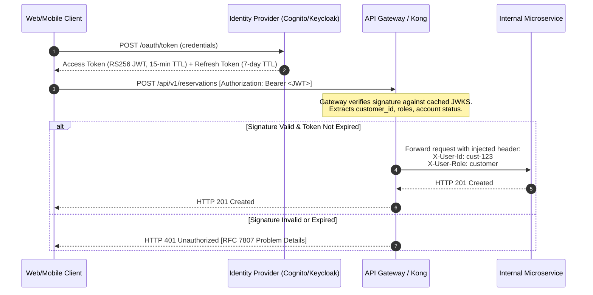

# SALESTORM 2026 | Authentication Architecture

## 1. Authentication Mechanisms

SALESTORM decouples authentication across three boundaries:
1. **Public Edge (Customer Auth)**: OAuth 2.0 / OpenID Connect (OIDC) JWT tokens.
2. **Payment Ingress (External Webhooks)**: Cryptographic HMAC-SHA256 signatures with timestamp anti-replay validation.
3. **Internal VPC Mesh (Inter-Service)**: Mutual TLS (mTLS) with SPIFFE/SPIRE X.509 identity certificates.

---

## 2. Customer Authentication Lifecycle

---

## 3. Webhook Authentication (Payment Providers)

External payment gateways (Stripe, Adyen) do not support OAuth. Webhooks are authenticated using symmetric HMAC-SHA256 signatures:
- **Header**: `X-Signature-SHA256: t=1791193205,v1=9a8bc4...`
- **Replay Protection Window**: 300 seconds.
- **Timing Safe Check**: Verification uses constant-time string comparison to prevent side-channel timing attacks.
