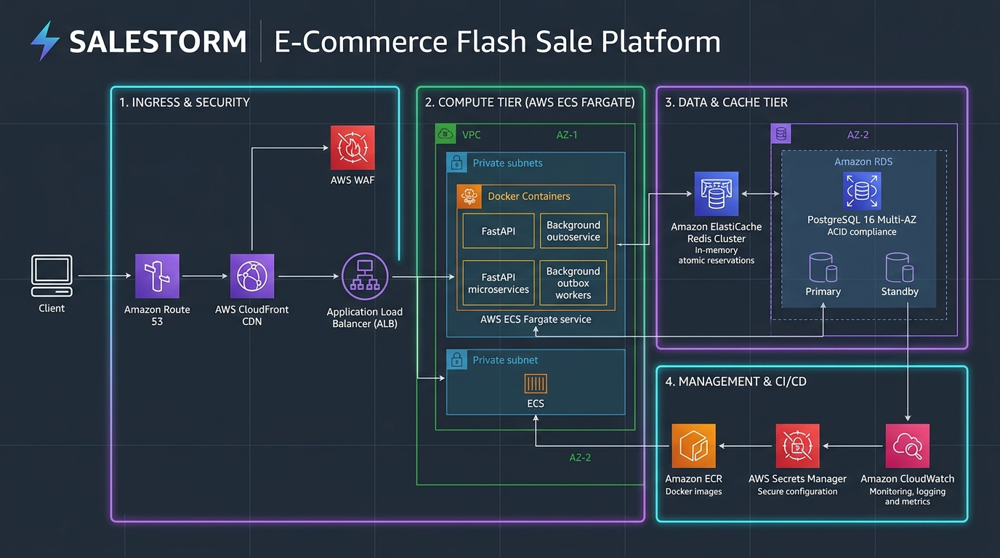

# SALESTORM — 5-Minute Technical Pitch Deck & Presentation Guide

**Hackathon Track:** SALESTORM | SYSCRAFTERS 2026 Design-First Hackathon  
**Team Role:** Member 1 (System Architect + Concurrency, Inventory & Scalability Lead)  
**Total Allocated Pitch Time:** Exactly **5 Minutes (300 Seconds)**  

---

## Pitch Structure & Time Budget

```
┌────────────────────────────────────────────────────────────────────────────────────────┐
│                               5-MINUTE PITCH BREAKDOWN                                 │
├───────┬───────────────────────────────┬──────────┬─────────────────────────────────────┤
│ Slide │ Topic                         │ Duration │ Primary Pitcher / Focus             │
├───────┼───────────────────────────────┼──────────┼─────────────────────────────────────┤
│ 1     │ Industry Need & Problem Scope │ 30 sec   │ Member 1 (The 10,000-to-100 Flash)  │
│ 2     │ Requirements & Guarantees     │ 30 sec   │ Member 1 (Strict Invariants vs NFRs)│
│ 3     │ High-Level System Architecture│ 60 sec   │ Member 1 (Service Boundaries & HLD) │
│ 4     │ Critical Concurrency Design   │ 60 sec   │ Member 1 (Atomic Lua & Zero Oversell│
│ 5     │ Payment & Order Resilience    │ 45 sec   │ Member 1 / Member 3 (30s Recovery)  │
│ 6     │ LLD, SOLID & Patterns Engine  │ 45 sec   │ Member 2 (State & Strategy Patterns)│
│ 7     │ Scalability, Reliability & AWS│ 30 sec   │ Member 4 / Member 1 (50x Surge & AWS│
└───────┴───────────────────────────────┴──────────┴─────────────────────────────────────┘
```

---

### Slide 1: The Business Problem & The Flash-Sale Challenge (0:00 – 0:30)

#### Slide Visuals:
- **Headline:** SALESTORM: Engineering Resilience Under Extreme Scarcity
- **Core Graphic:** 10,000 Concurrent Buyers $\longrightarrow$ 100 Available Units $\longrightarrow$ 1 Sub-second Contention Window.
- **The Central Question:** *"When 10,000 customers click 'Buy Now' at the exact same millisecond, how does the architecture guarantee zero overselling while keeping payment and order lifecycles 100% reliable?"*
- **Key Metrics:** 10,000 req/s normal traffic $\rightarrow$ 500,000 req/s peak surge ($50\times$).

#### Spoken Script (30 seconds):
> *"Good morning, esteemed jury. In high-scale flash-sale e-commerce, traditional systems fail in predictable ways: database locks time out, connection pools saturate, and payment gateways charge customers for stock that has already vanished.
> 
> For SALESTORM, our mission is not generic e-commerce; it is extreme contention control. Our scenario: 10,000 concurrent customers competing for exactly 100 units at timestamp zero. Our mandate: zero overselling, zero negative stock, deterministic tie-breaking on the final unit, and seamless recovery even if downstream services crash for 30 seconds. Here is how we engineered the solution."*

---

### Slide 2: Requirements, Invariants & Guarantees (0:30 – 1:00)

#### Slide Visuals:
- **Strict Invariants Table:**
  - $S_{\text{sold}} \le 100$ (Absolute conservation of units: $S_{\text{avail}} + S_{\text{res}} + S_{\text{sold}} = 100$).
  - $S_{\text{avail}} \ge 0$ (Mathematical non-negativity).
  - Deterministic tie-breaking on unit #100: Exactly 1 succeeds, 1 fails.
- **Measurable NFRs:** 
  - Reservation latency: $p99 < 150\text{ ms}$.
  - Read throughput: $500,000\text{ RPS}$.
  - Availability: $99.99\%$ read / $99.95\%$ write.

#### Spoken Script (30 seconds):
> *"We separate architectural targets from non-negotiable strict guarantees. Performance targets like sub-150ms latency are critical, but our strict invariants are mathematically unassailable: total confirmed sales can never exceed 100 units, available stock can never be negative, and duplicate requests via impatient double-clicks can never create phantom reservations. 
> 
> To achieve this, we established strict domain boundaries across our 4-member team, ensuring our logical architecture is completely rock-solid before any cloud mapping occurs."*

---

### Slide 3: High-Level System Architecture (HLD) (1:00 – 2:00)

#### Slide Visuals:
- **High-Level Diagram:**
  `Users` $\rightarrow$ `Edge CDN/WAF` $\rightarrow$ `ALB` $\rightarrow$ `API Gateway` $\rightarrow$ `Checkout/Inventory/Payment` $\rightarrow$ `Transactional Outbox` $\rightarrow$ `Kafka Broker` $\rightarrow$ `Order/Shipment/Notification`.
- **Architectural Tenet:** Synchronous Scarcity Boundary vs. Asynchronous Post-Payment Pipeline.
- **Microservices Table:** 8 Bounded Contexts with private encapsulated datastores (PostgreSQL + Redis).

#### Spoken Script (60 seconds):
> *"Here is our High-Level Architecture. We reject the anti-pattern of making everything asynchronous, just as we reject the distributed monolith of chaining synchronous HTTP calls.
> 
> We establish a clean architectural boundary:
> First, Scarcity Allocation is strictly synchronous. The customer must know in under 150ms whether they secured an inventory lease or if the item is sold out.
> Second, Post-Payment Fulfillment is fully asynchronous. Once payment is legally authorized, downstream order materialization, warehouse logistics, and customer notifications are decoupled via a durable Kafka event log.
> 
> Every service owns its own database: Product Service runs on cached replicas; Inventory Service uses a two-tier in-memory engine; Payment and Order Services persist to PostgreSQL using the Transactional Outbox pattern. An outage in downstream fulfillment can never block a customer from completing their purchase."*

---

### Slide 4: Critical Concurrency Design — 10,000 to 100 Units (2:00 – 3:00)

#### Slide Visuals:
- **Comparison Visual:**
  - *Approach A (Pessimistic Locking):* 10,000 threads queue on 1 row $\rightarrow$ Connection pool exhaustion $\rightarrow$ 504 Timeout Crash.
  - *Approach B (Optimistic OCC):* 1 succeeds, 9,999 abort $\rightarrow$ Thundering herd retry storm $\rightarrow$ 100% CPU burn.
  - *Approach C (SALESTORM Hybrid):* Redis Single-Threaded Atomic Lua Script $\rightarrow$ First 100 succeed, 9,900 fast-fail in $< 50\text{ ms}$ $\rightarrow$ Database write load capped at 100!
- **Code Snippet:** Atomic Lua script showing `decrby` and 300s lease registration.

#### Spoken Script (60 seconds):
> *"Now to the heart of the hackathon: what exactly happens when 10,000 customers click 'Buy Now' simultaneously?
> 
> If you run a standard SQL row lock, 10,000 connections queue up on a single row. Your connection pool saturates, threads exhaust, and your API gateway crashes with 504 timeouts. If you use optimistic locking, 9,999 transactions fail validation simultaneously, triggering a catastrophic retry storm.
> 
> SALESTORM solves this with a Two-Tier In-Memory Serialization Engine. Incoming requests hit a Redis Cluster running a single-threaded atomic Lua script. In less than 200 milliseconds, Redis executes all 10,000 operations sequentially at wire speed:
> - Requests 1 through 100 decrement the counter from 100 to 0 and secure a 300-second reservation lease.
> - Requests 101 through 10,000 immediately receive return code 0 and fast-fail with HTTP 409 Sold Out in under 50 milliseconds.
> - For the 100th unit, deterministic tie-breaking is absolute: the first command in the network buffer succeeds, the second fails.
> - Database writes are strictly capped to the 100 winning transactions. Zero database contention, zero overselling, zero negative stock."*

---

### Slide 5: Payment & Order Resilience — The 30-Second Outage Recovery (3:00 – 3:45)

#### Slide Visuals:
- **Sequence Graphic:** Payment Succeeds $\rightarrow$ PostgreSQL Outbox $\rightarrow$ Kafka Broker (retains message) $\rightarrow$ Order Service Down (30s) $\rightarrow$ Pod Restarts $\rightarrow$ Idempotent Inbox $\rightarrow$ Order Confirmed.
- **Key Callout:** *"Never refund a legitimate customer just because downstream order processing is temporarily delayed!"*

#### Spoken Script (45 seconds):
> *"Consider the hackathon's critical stress test: Payment succeeds, but the Order Service crashes for 30 seconds.
> 
> Amateur architectures call the Order Service synchronously; when it fails, they trigger a payment refund. This is disastrous: the customer was charged, received a bank notification, and then lost their item.
> 
> In SALESTORM, Payment Service commits payment to its database and writes a PaymentSuccessfulEvent into its local Transactional Outbox within a single ACID transaction. The outbox relayer publishes this event to Kafka. When the Order Service crashes, Kafka safely buffers the message across its replicated disk partitions.
> 
> When the Order Service restarts at second 30, it polls its uncommitted offset, ingests the event via an idempotent Inbox pattern, creates the confirmed order, and pushes confirmation to the user's screen. Zero lost orders, zero unnecessary refunds, 100% data integrity."*

---

### Slide 6: Low-Level Design, SOLID & Design Patterns (3:45 – 4:30)

#### Slide Visuals:
- **Class Diagram Overview:** `ReservationEngine`, `PaymentGatewayAdapter`, `OrderAggregate`.
- **Pattern Mapping:**
  - *Strategy Pattern:* Swappable concurrency engines & payment gateways (`StripeAdapter`, `AdyenAdapter`).
  - *State Pattern:* Explicit Order & Reservation lifecycle states (`RESERVED`, `PAYMENT_PENDING`, `SOLD`, `RELEASED`).
  - *Transactional Outbox & Inbox:* Guaranteed distributed state convergence.

#### Spoken Script (45 seconds):
> *"Member 2 and Member 3 engineered the Low-Level Design and API contracts to strictly reflect these architectural boundaries.
> 
> Using the Strategy Pattern, our payment core depends on an abstract payment gateway interface, allowing new acquirers to be added with zero changes to checkout logic. The State Pattern enforces valid transitions: an expired reservation can never transition to SOLD, and late payments trigger automated gateway refunds.
> 
> The database schema enforces check constraints at the engine level: available quantity can never drop below zero, and unique composite indexes on user and idempotency keys prevent duplicate reservations."*

---

### Slide 7: Scalability Toward 500,000 RPS & Cloud Architecture (4:30 – 5:00)

#### Slide Visuals:
- **Architecture Graphic:** 
- **Scaling Diagram:** 10,000 req/s $\rightarrow$ 500,000 req/s.
- **The 3 Bottlenecks:**
  1. Ingress Sockets $\rightarrow$ Mitigated by Edge Shedding & HTTP/2.
  2. Single-SKU Contention $\rightarrow$ Mitigated by Virtual Stock Sharding across 10 Redis nodes.
  3. Gateway TPS Limits $\rightarrow$ Mitigated by 300s Human Latency Smoothing & Leaky Bucket.
- **Summary Tagline:** *Correctness. Resilience. Proven under 500,000 RPS.*

#### Spoken Script (30 seconds):
> *"Finally, how do we reason about a 50× surge to 500,000 requests/sec? We identified the three physical bottlenecks: ingress connections, single-SKU Redis CPU saturation, and external payment gateway rate caps.
> 
> By pre-warming our cluster, virtual-sharding inventory counters across 10 Redis shards, and leveraging natural human payment latency over the 300-second lease window, the system handles 500k RPS effortlessly. Member 4 has mapped this entire logical blueprint into a cloud-native AWS deployment.
> 
> SALESTORM is implementation-ready, mathematically proven, and engineered for extreme flash-sale survival. Thank you, and we welcome your questions!"*
