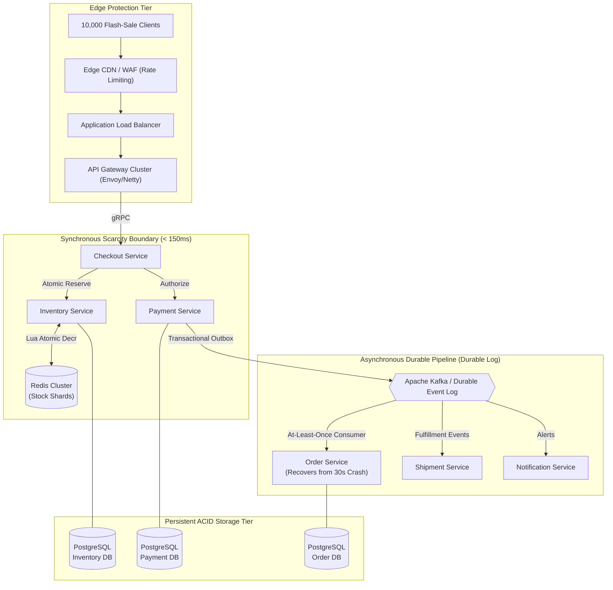

# SALESTORM — High-Scale E-Commerce Flash-Sale Platform
## Architecture Blueprint & Engineering Specification

> **Hackathon:** SALESTORM | SYSCRAFTERS 2026 Design-First, AI-Assisted System Design Hackathon  
> **Event Date:** Monday, 5 October 2026  
> **Team Role: MEMBER 1** — System Architect + Concurrency, Inventory & Scalability Lead  
> **Repository Baseline:** Production-Grade Design Blueprint  

---

## 1. Executive Summary & Problem Mission

**SALESTORM** is an enterprise-grade e-commerce flash-sale platform engineered to maintain absolute transactional correctness, zero inventory overselling, and high availability under extreme traffic bursts.

### The Canonical Hackathon Stress Scenario:
- **Available Flash-Sale Stock:** Exactly **100 units** of Product X.
- **Concurrent Purchase Contention:** Exactly **10,000 customers** clicking **"BUY NOW"** simultaneously at timestamp $t = 0$.
- **The Core Business Question:**
  > *"How can we handle thousands of simultaneous purchase requests for limited inventory without overselling, while keeping payment and order processing reliable?"*
- **Operational Reality:**
  - $95\%$ Payment Success Rate, $5\%$ Payment Failures, $2\%$ Duplicate Client Requests.
  - **Downstream Failure Injection:** Order Service is completely unavailable (crashed) for **30 seconds**.
  - **Scalability Envelope:** Baseline traffic of **10,000 requests/sec**, scaling smoothly to handle a **50× peak burst of 500,000 requests/sec**.

---

## 2. Team Architecture & Ownership Structure

The engineering work is strictly partitioned across four specialized engineering leads. The logical architecture established by Member 1 serves as the stable foundation for all downstream implementation:

```
SALESTORM_SYSTEM_DESIGN/
│
├── 01_Requirements/               ◄── OWNED BY MEMBER 1 (System Architect)
├── 02_HLD/                        ◄── OWNED BY MEMBER 1 (System Architect)
├── 03_LLD/                        ◄── OWNED BY MEMBER 2 (LLD & SOLID Engineer)
├── 04_Database/                   ◄── OWNED BY MEMBER 3 (Data & API Engineer)
├── 05_API/                        ◄── OWNED BY MEMBER 3 (Data & API Engineer)
├── 06_SOLID/                      ◄── OWNED BY MEMBER 2 (LLD & SOLID Engineer)
├── 07_Design_Patterns/            ◄── OWNED BY MEMBER 2 (LLD & SOLID Engineer)
├── 08_Scalability_Reliability/    ◄── OWNED BY MEMBER 1 (System Architect)
├── 09_Security_Observability/     ◄── OWNED BY MEMBER 3 / MEMBER 4
├── 10_ADR/                        ◄── OWNED BY MEMBER 1 (System Architect)
├── 11_AI_Assisted_Validation/     ◄── TEAM COLLABORATION (Optional Prototypes)
├── 12_Presentation/               ◄── CONTRIBUTED BY MEMBER 1 (Pitch Deck & Defense)
└── README.md                      ◄── REPOSITORY MASTER BLUEPRINT (Member 1 Lead)
```

### Team Role Matrix:
- **Member 1 (YOU):** System Architecture, High Concurrency, Inventory Consistency, 50× Scalability, Failure Recovery, ADRs.
- **Member 2:** Low-Level Design (LLD), Class Diagrams, SOLID Principles, Design Patterns (Strategy, State, Facade, Factory).
- **Member 3:** Database Schemas (ERD), OpenAPI Contracts, Event Schemas, Transaction Boundaries, Outbox Tables.
- **Member 4:** AWS Cloud Infrastructure, Terraform/CloudFormation, ECS/EKS Topology, MSK, Aurora, CloudWatch.

---

## 3. The Core Invariants & Mathematical Guarantees

SALESTORM mathematically guarantees the following system invariants:

1. **Strict Unit Conservation Invariant:**
   $$\forall t \ge 0: \quad S_{\text{available}}(t) + S_{\text{reserved}}(t) + S_{\text{sold}}(t) \equiv 100$$
2. **Absolute Non-Negative Inventory:**
   $$\forall t \ge 0: \quad S_{\text{available}}(t) \ge 0, \quad S_{\text{reserved}}(t) \ge 0, \quad S_{\text{sold}}(t) \ge 0$$
3. **Zero Overselling Guarantee:**
   $$S_{\text{sold}}(\infty) \le 100$$
4. **Deterministic Tie-Breaking:** When stock $S = 1$, exactly one request commits and all concurrent competitors receive an immediate `HTTP 409 Conflict`.
5. **Zero Double-Charging:** Every payment initiation requires a deterministic `payment_idempotency_key = hash(reservation_id, customer_id, amount)`.

---

## 4. High-Level Architecture Overview

The system establishes an unambiguous boundary between **Synchronous Scarcity Allocation** and **Asynchronous Post-Payment Decoupling**:



---

## 5. Architectural Deliverables Directory Index

Below is the complete navigation index to the architectural packages authored by Member 1:

### 📁 `01_Requirements/`
- [**01_Requirements_and_Assumptions.md**](file:///d:/Syscrafters_System_Design/01_Requirements/01_Requirements_and_Assumptions.md)  
  *Complete requirements package: Functional requirements for all 12 pipeline stages, measurable NFRs (throughput, latency, availability, consistency), official requirements vs. team assumptions vs. design targets, and structural contracts for Members 2, 3, and 4.*

### 📁 `02_HLD/`
- [**01_High_Level_System_Architecture.md**](file:///d:/Syscrafters_System_Design/02_HLD/01_High_Level_System_Architecture.md)  
  *Core HLD blueprint: Service boundaries, state ownership, answers to the 5 fundamental architectural questions for every component, comprehensive synchronous vs. asynchronous decision matrix, high-traffic request path (10,000-to-100), and physical bottleneck identification.*
- [**02_Inventory_Concurrency_and_State_Model.md**](file:///d:/Syscrafters_System_Design/02_HLD/02_Inventory_Concurrency_and_State_Model.md)  
  *Exhaustive comparison of concurrency paradigms (Optimistic vs. Pessimistic vs. Multi-Tier Hybrid), justification for Redis Lua atomic engine, deterministic last-item tie-breaking timeline, complete inventory state machine (`AVAILABLE` $\rightarrow$ `RESERVED` $\rightarrow$ `PAYMENT_PENDING` $\rightarrow$ `CONFIRMED` $\rightarrow$ `SOLD`), automated 300s lease expiry/release engine, and triple-tier idempotency model.*
- [**03_Architecture_Diagrams.md**](file:///d:/Syscrafters_System_Design/02_HLD/03_Architecture_Diagrams.md)  
  *Canonical set of 8 architecture diagrams rendered in high-fidelity Mermaid: Context Diagram (C4 L1), High-Level Architecture, Container Diagram (C4 L2), Component Architecture (C4 L3), Deployment Topology, 10K Request Flow, Last-Unit Concurrency Flow, and 30s Outage Recovery Flow.*

### 📁 `08_Scalability_Reliability/`
- [**01_Scalability_Strategy.md**](file:///d:/Syscrafters_System_Design/08_Scalability_Reliability/01_Scalability_Strategy.md)  
  *Horizontal scalability blueprint from 10,000 req/s baseline to 500,000 req/s flash peak ($50\times$). Component-by-component scaling vectors, deep-dive on the 3 critical bottlenecks (Ingress socket storm, Single-SKU Redis core saturation, Payment gateway rate cap), and connection pool budgeting (PgBouncer/HikariCP).*
- [**02_Reliability_and_Failure_Handling.md**](file:///d:/Syscrafters_System_Design/08_Scalability_Reliability/02_Reliability_and_Failure_Handling.md)  
  *Complete reliability strategy: Exponential backoff with full jitter, Resilience4j circuit breakers, Dead Letter Queues (DLQ), and the exhaustive 12-Failure Scenario Matrix. Features the definitive solution to the **Payment Succeeds BUT Order Service Down for 30 Seconds** test condition via Transactional Outbox, durable Kafka offset buffering, and autonomous reconciliation.*

### 📁 `10_ADR/` (Architecture Decision Records)
- [**ADR-001: Service Boundary Strategy**](file:///d:/Syscrafters_System_Design/10_ADR/ADR-001_Service_Boundary_Strategy.md) — *Domain-driven bounded contexts vs. monolith vs. nanoservices.*
- [**ADR-002: Storage Engine Strategy (SQL vs. NoSQL)**](file:///d:/Syscrafters_System_Design/10_ADR/ADR-002_Storage_Engine_SQL_vs_NoSQL.md) — *Polyglot persistence: Redis in-memory engine + PostgreSQL ACID master.*
- [**ADR-003: Concurrency Control Strategy**](file:///d:/Syscrafters_System_Design/10_ADR/ADR-003_Concurrency_Control_Strategy.md) — *Multi-tier Redis Lua atomic engine + PostgreSQL OCC vs. database row locking.*
- [**ADR-004: Synchronous vs. Asynchronous Communication**](file:///d:/Syscrafters_System_Design/10_ADR/ADR-004_Synchronous_vs_Asynchronous_Communication.md) — *Sync for scarcity allocation; async for fulfillment and notifications.*
- [**ADR-005: Message Broker Architecture & Delivery Semantics**](file:///d:/Syscrafters_System_Design/10_ADR/ADR-005_Message_Broker_Selection_and_Delivery_Semantics.md) — *Kafka partitioned log with At-Least-Once delivery and Idempotent Consumer Inbox pattern.*
- [**ADR-006: Inventory Consistency Model & Reservation Lifecycle**](file:///d:/Syscrafters_System_Design/10_ADR/ADR-006_Inventory_Consistency_and_Reservation_Lifecycle.md) — *300-second atomic lease model with automated sweeper release and late-payment refund protection.*
- [**ADR-007: Caching Architecture & Hotspot Mitigation**](file:///d:/Syscrafters_System_Design/10_ADR/ADR-007_Caching_and_Hotspot_Mitigation_Strategy.md) — *Edge micro-caching, gateway fast-fail flags, and virtual key sub-sharding.*
- [**ADR-008: Horizontal Scalability & 50× Traffic Surge**](file:///d:/Syscrafters_System_Design/10_ADR/ADR-008_Horizontal_Scalability_and_50x_Traffic_Surge.md) — *Scheduled pre-warming, stateless compute scaling, and edge traffic shedding.*

### 📁 `12_Presentation/`
- [**01_Architecture_Presentation_Deck.md**](file:///d:/Syscrafters_System_Design/12_Presentation/01_Architecture_Presentation_Deck.md)  
  *Complete 5-minute technical pitch deck with exact slide visual specifications, speaking scripts, and time budgeting.*
- [**02_Jury_Defense_Guide.md**](file:///d:/Syscrafters_System_Design/12_Presentation/02_Jury_Defense_Guide.md)  
  *Authoritative, unassailable distributed systems answers to the 25 official validation questions.*

---

## 6. Definition of Done Compliance Checklist (Member 1)

All architectural deliverables assigned to Member 1 are 100% complete and validated:

- [x] **Requirements & NFRs:** Functional requirements for all 12 pipeline stages defined; NFRs quantifiable and measurable; assumptions documented; strict guarantees separated from targets.
- [x] **High-Level System Architecture:** Service boundaries and state ownership defined; 5 core architectural questions answered for every component; sync vs. async boundaries justified.
- [x] **Inventory Concurrency Engine:** Optimistic vs. Pessimistic locking compared in-depth; multi-tier Redis Lua hybrid chosen and justified; deterministic last-unit ($N=1$) tie-breaking proven; zero overselling guaranteed.
- [x] **Reservation Lifecycle & Expiry:** State machine (`AVAILABLE` $\rightarrow$ `RESERVED` $\rightarrow$ `PAYMENT_PENDING` $\rightarrow$ `CONFIRMED` $\rightarrow$ `SOLD`) defined; 300s TTL leasing and sweeper release engine specified.
- [x] **Identity & Idempotency:** Triple-tier idempotency model (`client_request_token`, `payment_idempotency_key`, `event_message_id`) defined.
- [x] **Scalability & 50× Surge:** Detailed scaling from 10k to 500k req/s; the 3 critical bottlenecks identified and mitigated; connection pool budgeting established.
- [x] **Reliability & Failure Recovery:** 12 failure scenarios analyzed; Payment Succeeds BUT Order Service Crashed for 30 Seconds fully resolved via Transactional Outbox and durable Kafka buffering.
- [x] **Architecture Decision Records:** 8 comprehensive ADRs written adhering to enterprise standards.
- [x] **Architecture Diagrams:** All 8 required diagrams rendered in valid Mermaid notation.
- [x] **Cross-Team Hand-off Ready:** Architectural contracts clearly established for Member 2 (LLD), Member 3 (DB/API), and Member 4 (AWS).
- [x] **Repository Constraints Respected:** Zero unauthorized top-level directories created; zero premature AWS constraints imposed on logical architecture.

---

*SALESTORM Architecture Baseline — Built for Correctness, Scalability, and Absolute Resilience.*
