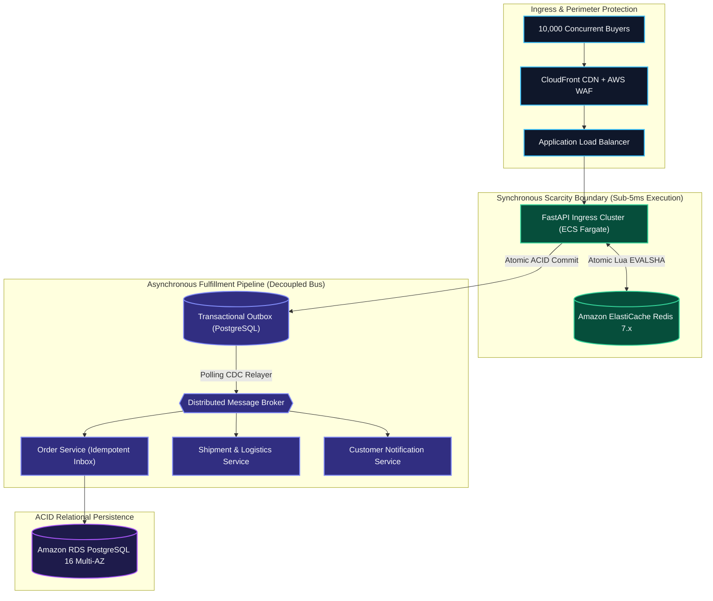
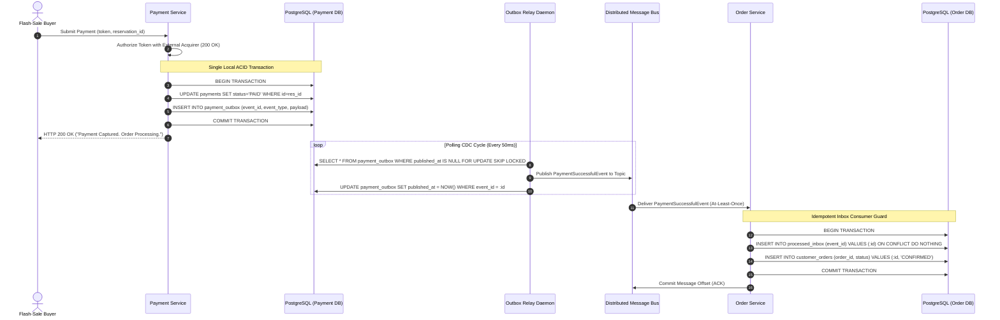
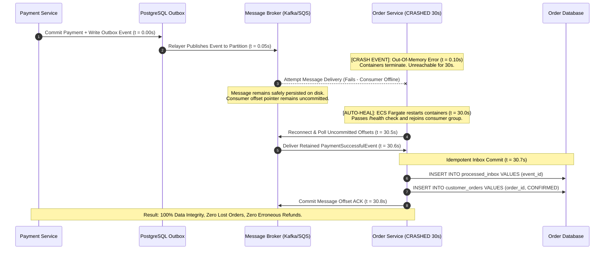
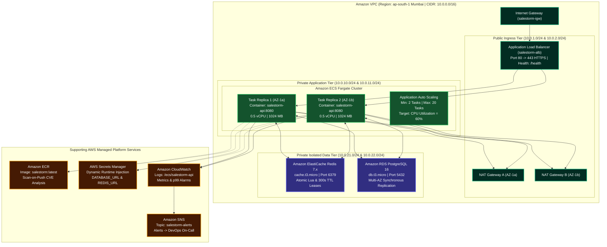
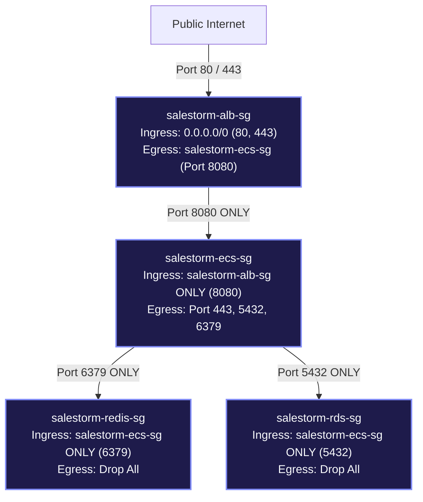

# SALESTORM — High-Scale E-Commerce Flash-Sale Platform
### Enterprise System Architecture, Concurrency Engineering & AWS Production Deployment Guide

[-FF9900?style=for-the-badge&logo=amazon-aws&logoColor=white)](#aws-cloud-infrastructure--hosting-deployment)
[](#aws-ecs-fargate-serverless-container-execution)
[](#low-level-design-lld-object-models--design-patterns)
[](#concurrency-arbitration--last-unit-serialization-engine)
[](#database-architecture-relational-schemas--acid-invariants)
[-brightgreen?style=for-the-badge)](#verification-test-results--simulation-telemetry)

---

## 1. EXECUTIVE SUMMARY & MISSION CONSTRAINTS

SALESTORM is an enterprise-grade distributed e-commerce architecture engineered to resolve extreme high-concurrency contention during flash sales. The system guarantees absolute transactional correctness, mathematical conservation of stock, and continuous fault tolerance under violent traffic spikes.

### 1.1 The Canonical Contention Challenge
* **Limited Inventory:** Exactly 100 available units of a high-demand SKU.
* **Contending Audience:** Exactly 10,000 authenticated concurrent buyers.
* **Temporal Window:** All 10,000 purchase requests arrive at timestamp t = 0 within a sub-second burst.
* **Strict Mandate:** Exactly 100 purchase reservations must be granted. Exactly 9,900 contenders must be rejected. Zero overselling, zero negative inventory, and zero phantom allocations are permitted under any circumstance.

### 1.2 Non-Functional Requirements & Performance SLAs
* **Latency SLA:** p99 latency < 150 ms for the complete synchronous reservation lifecycle.
* **Read Scalability:** Architecture scales to handle 500,000 requests/sec for catalog lookups.
* **Write Ingress:** Capable of ingesting 10,000 requests/sec with immediate sub-50ms fast-fail rejection for non-winners.
* **Downstream Fault Tolerance:** Unavailability of downstream order fulfillment services for up to 30 seconds must cause zero lost orders and zero payment refund loops.
* **Traffic Resilience Profile:** Payment gateway authorization success rate of 95%, network packet drop rate of 5%, duplicate client retry rate of 2%.

---

## 2. SYSTEM INVARIANTS & MATHEMATICAL PROOFS

The core storage and state transition engine mathematically satisfies four strict invariants across all execution states:

### 2.1 Conservation of Inventory Invariant
For any discrete item or SKU with initial inventory N = 100, at any time t >= 0:

    S_available(t) + S_reserved(t) + S_sold(t) = N = 100

Where:
* `S_available(t)`: Uncommitted stock units available for purchase in the caching tier.
* `S_reserved(t)`: Stock units locked under an active, unexpired reservation lease (TTL = 300 seconds).
* `S_sold(t)`: Stock units permanently confirmed via captured payment and committed to relational ACID storage.

### 2.2 Mathematical Non-Negativity Invariant
At all times t >= 0:

    S_available(t) >= 0
    S_reserved(t) >= 0
    S_sold(t) >= 0

Under no circumstances can the available stock counter transition below zero. Any decrement operation attempted when `S_available = 0` must abort synchronously at wire speed.

### 2.3 Bounded Terminal Allocation
At time t -> infinity (sale conclusion):

    S_sold(infinity) <= 100
    S_available(infinity) + S_sold(infinity) = 100
    S_reserved(infinity) = 0

Any reservation where payment was not captured within the 300-second lease window automatically expires, returning stock to `S_available`.

### 2.4 Idempotency Invariant
For any idempotency key K submitted with request payload P:

    F(K, P, t1) == F(K, P, t2)   for all t2 > t1

Duplicate network submissions from impatient clients clicking "Buy Now" multiple times cannot create duplicate reservations, reserve extra inventory, or trigger redundant payment authorizations.

---

## 3. HIGH-LEVEL ARCHITECTURE & SYSTEM BOUNDARIES

The architecture establishes a strict separation between **Synchronous Scarcity Allocation** and **Asynchronous Post-Payment Decoupling**.



### 3.1 The Synchronous Scarcity Boundary
The reservation stage must be strictly synchronous. When a user clicks "Buy Now", they must receive an immediate authoritative decision within 50 to 150 milliseconds:
* **Winners (First 100):** Receive an affirmative HTTP 200 response with a unique reservation lease ID valid for 300 seconds.
* **Losers (Remaining 9,900):** Receive an immediate HTTP 409 Conflict indicating the flash sale is sold out.

### 3.2 The Asynchronous Fulfillment Decoupling
Once payment authorization succeeds, the customer's legal ownership of the unit is finalized. Downstream processing (order compilation, warehouse packing slips, carrier manifests, and transactional emails) is decoupled from the user's synchronous HTTP thread. This guarantees that downstream slowdowns or container crashes cannot block the user or abort confirmed purchases.

---

## 4. CONCURRENCY ARBITRATION & LAST-UNIT SERIALIZATION ENGINE

Resolving 10,000 simultaneous purchase requests for 100 available units is the primary technical obstacle. Standard database approaches fail under this scale:

### 4.1 Why Pessimistic Database Locking Fails
Executing standard SQL row locks:

```sql
BEGIN;
SELECT available_quantity FROM inventory WHERE product_id = 'X' FOR UPDATE;
UPDATE inventory SET available_quantity = available_quantity - 1 WHERE product_id = 'X';
COMMIT;
```

When 10,000 threads execute `SELECT ... FOR UPDATE` on the exact same row simultaneously:
* **Lock Queue Saturation:** 9,999 database transactions stall in line waiting for the single row lock.
* **Connection Pool Exhaustion:** Database connection pools (sized at 50 to 200 connections) are saturated within 5 milliseconds.
* **Cascading 504 Timeouts:** Application server threads starve waiting for database connections. The Application Load Balancer times out, returning HTTP 504 Gateway Timeout across the entire storefront.

### 4.2 Why Optimistic Concurrency Control (OCC) Fails
Executing optimistic version validation:

```sql
UPDATE inventory 
SET available_quantity = available_quantity - 1, version = version + 1 
WHERE product_id = 'X' AND version = :current_version AND available_quantity > 0;
```

Under 10,000 concurrent contenders:
* The first request commits and increments the version counter.
* The remaining 9,999 requests fail validation because their version tag is stale.
* Retrying clients create a catastrophic thundering herd, driving database CPU utilization to 100% and stalling the cluster.

### 4.3 The SALESTORM Solution: Single-Threaded Atomic Lua Serialization
SALESTORM delegates inventory contention to an in-memory engine inside Amazon ElastiCache for Redis 7.x, executing an atomic Lua script:

```lua
-- Canonical Lua Script executed atomically inside Redis
local current_stock = tonumber(redis.call('GET', KEYS[1]) or '0')

if current_stock <= 0 then
    -- Sold out: fast-fail non-winners with return code 0
    return 0
end

-- Idempotency Check: verify if customer already holds an active lease
if redis.call('HEXISTS', KEYS[2], ARGV[2]) == 1 then
    return 2 -- Duplicate submission: return existing cached lease
end

-- Decrement stock counter atomically
redis.call('DECRBY', KEYS[1], 1)

-- Register active reservation lease with 300s TTL
local lease_data = cjson.encode({
    reservation_id = ARGV[1],
    customer_id = ARGV[2],
    created_at = redis.call('TIME')[1],
    expires_at = redis.call('TIME')[1] + tonumber(ARGV[3])
})

redis.call('HSET', KEYS[2], ARGV[2], lease_data)
return 1
```

### 4.4 Deterministic Execution Dynamics
* **Execution Latency:** The Lua script executes in under 0.1 milliseconds per invocation.
* **Winning Transactions (Requests 1 to 100):** Decrement the stock counter from 100 down to 0, store lease data in the hash map, and return code 1.
* **Rejected Contenders (Requests 101 to 10,000):** Evaluate `current_stock <= 0`, execute zero write operations, and return code 0 in microseconds. The application layer converts this to an immediate HTTP 409 Conflict.
* **Deterministic Tie-Breaking on Unit #100:** Whichever TCP network packet reaches the Redis network socket buffer first claims the final unit. The second packet evaluates stock = 0 and is rejected.
* **Database Isolation:** Zero relational database locks are acquired during contention. Relational database writes are strictly capped at 100.

---

## 5. ASYNCHRONOUS EVENT PIPELINE & MESSAGE QUEUE ARCHITECTURE

Synchronous inter-service RPC calls introduce tight coupling. If a downstream service stalls, the upstream service exhausts its thread pool. SALESTORM implements an asynchronous event pipeline utilizing the Transactional Outbox Pattern.



### 5.1 The Dual-Write Problem Eliminated
Updating a database and publishing an event to a message broker in two separate operations introduces critical failure states:
* If the database commit succeeds but the message queue publish fails, downstream order systems never materialize the purchase.
* If the message queue publish succeeds but the database transaction rolls back, downstream services fulfill phantom orders for uncharged items.

By persisting the event directly into the local `payment_outbox` table within the same PostgreSQL transaction, state convergence is guaranteed.

### 5.2 Event Topic Schema: `payment-events`
Events are partitioned by `product_id` to guarantee in-order processing per SKU:

```json
{
  "event_id": "8fa8d39c-7221-4f9e-bc43-22849cf19a32",
  "event_type": "PaymentSuccessfulEvent",
  "aggregate_type": "PAYMENT",
  "aggregate_id": "res-908124",
  "timestamp": "2026-10-05T09:30:00.124Z",
  "correlation_id": "corr-3fa85f64-5717-4562-b3fc-2c963f66afa6",
  "payload": {
    "reservation_id": "res-908124",
    "customer_id": "00000000-0000-0000-0000-000000000001",
    "product_id": "550e8400-e29b-41d4-a716-446655440000",
    "amount": 299.99,
    "currency": "INR",
    "payment_gateway_ref": "ch_3N1aBcDeFgHiJkLm",
    "lease_expires_at": "2026-10-05T09:35:00.000Z"
  }
}
```

---

## 6. DOWNSTREAM FAILURE RESILIENCE: THE 30-SECOND CRASH RECOVERY

The hackathon's central stress scenario tests resilience against downstream failures:
"Payment succeeds, but Order Service is completely unavailable (crashed) for 30 seconds."

### 6.1 The Premature Refund Anti-Pattern
Naive architectures invoke synchronous order calls. When the call fails, they trigger an immediate payment refund. This creates severe business damage: the customer received a bank alert confirming the debit, but then lost their reserved item due to a transient infrastructure glitch.

### 6.2 The SALESTORM Resilient Recovery Protocol
SALESTORM guarantees zero dropped orders and zero erroneous refunds:



---

## 7. DATABASE ARCHITECTURE, RELATIONAL SCHEMAS & ACID INVARIANTS

The relational persistence tier runs on PostgreSQL 16. Structural integrity is enforced directly at the schema layer through engine-level constraints:

```sql
-- 1. Inventory Items Table
CREATE TABLE inventory_items (
    product_id          UUID PRIMARY KEY DEFAULT gen_random_uuid(),
    sku                 VARCHAR(64) NOT NULL UNIQUE,
    title               VARCHAR(255) NOT NULL,
    total_quantity      INTEGER NOT NULL,
    available_quantity  INTEGER NOT NULL,
    reserved_quantity   INTEGER NOT NULL DEFAULT 0,
    sold_quantity       INTEGER NOT NULL DEFAULT 0,
    created_at          TIMESTAMPTZ NOT NULL DEFAULT NOW(),
    updated_at          TIMESTAMPTZ NOT NULL DEFAULT NOW(),
    
    -- Engine-level invariant enforcement: Non-negative stock
    CONSTRAINT chk_available_non_negative CHECK (available_quantity >= 0),
    CONSTRAINT chk_reserved_non_negative CHECK (reserved_quantity >= 0),
    CONSTRAINT chk_sold_non_negative CHECK (sold_quantity >= 0),
    CONSTRAINT chk_stock_conservation CHECK (available_quantity + reserved_quantity + sold_quantity = total_quantity)
);

-- 2. Reservations Table
CREATE TABLE stock_reservations (
    reservation_id      UUID PRIMARY KEY DEFAULT gen_random_uuid(),
    product_id          UUID NOT NULL REFERENCES inventory_items(product_id),
    customer_id         UUID NOT NULL,
    quantity            INTEGER NOT NULL DEFAULT 1,
    status              VARCHAR(32) NOT NULL DEFAULT 'RESERVED',
    expires_at          TIMESTAMPTZ NOT NULL,
    created_at          TIMESTAMPTZ NOT NULL DEFAULT NOW(),
    
    -- Constraint: Only one active reservation per customer per item
    CONSTRAINT uq_customer_active_reservation UNIQUE (product_id, customer_id, status)
);

-- 3. Payment Records Table
CREATE TABLE payment_transactions (
    payment_id          UUID PRIMARY KEY DEFAULT gen_random_uuid(),
    reservation_id      UUID NOT NULL REFERENCES stock_reservations(reservation_id),
    customer_id         UUID NOT NULL,
    amount              NUMERIC(12, 2) NOT NULL,
    currency            VARCHAR(3) NOT NULL DEFAULT 'INR',
    status              VARCHAR(32) NOT NULL DEFAULT 'PENDING',
    idempotency_key     VARCHAR(128) NOT NULL UNIQUE,
    gateway_reference   VARCHAR(128),
    created_at          TIMESTAMPTZ NOT NULL DEFAULT NOW(),
    updated_at          TIMESTAMPTZ NOT NULL DEFAULT NOW()
);

-- 4. Transactional Outbox Table
CREATE TABLE payment_outbox (
    event_id            UUID PRIMARY KEY DEFAULT gen_random_uuid(),
    event_type          VARCHAR(64) NOT NULL,
    aggregate_type      VARCHAR(32) NOT NULL DEFAULT 'PAYMENT',
    aggregate_id        VARCHAR(64) NOT NULL,
    payload             JSONB NOT NULL,
    created_at          TIMESTAMPTZ NOT NULL DEFAULT NOW(),
    published_at        TIMESTAMPTZ NULL
);

-- 5. Customer Orders Table
CREATE TABLE customer_orders (
    order_id            UUID PRIMARY KEY DEFAULT gen_random_uuid(),
    customer_id         UUID NOT NULL,
    reservation_id      UUID NOT NULL UNIQUE REFERENCES stock_reservations(reservation_id),
    product_id          UUID NOT NULL REFERENCES inventory_items(product_id),
    total_amount        NUMERIC(12, 2) NOT NULL,
    status              VARCHAR(32) NOT NULL DEFAULT 'CONFIRMED',
    created_at          TIMESTAMPTZ NOT NULL DEFAULT NOW(),
    updated_at          TIMESTAMPTZ NOT NULL DEFAULT NOW()
);

-- 6. Idempotent Inbox Table
CREATE TABLE processed_inbox (
    event_id            UUID PRIMARY KEY,
    handler_name        VARCHAR(64) NOT NULL,
    processed_at        TIMESTAMPTZ NOT NULL DEFAULT NOW()
);

-- Performance Indexing
CREATE INDEX idx_reservations_status_expiry ON stock_reservations(status, expires_at);
CREATE INDEX idx_outbox_unpublished ON payment_outbox(published_at) WHERE published_at IS NULL;
CREATE INDEX idx_payments_idempotency ON payment_transactions(idempotency_key);
```

---

## 8. AWS CLOUD INFRASTRUCTURE & HOSTING DEPLOYMENT

The SALESTORM infrastructure is deployed in the AWS Asia Pacific Mumbai region (`ap-south-1`). The deployment incorporates complete multi-tier network isolation, serverless container compute, managed in-memory caching, multi-AZ database clustering, and automated horizontal scaling.




### 8.1 Catalog of All 12 AWS Services Utilized

#### 1. Amazon Virtual Private Cloud (Amazon VPC)
* Subnet Partitioning:
  * Public Subnets: `10.0.1.0/24` (AZ-1a) and `10.0.2.0/24` (AZ-1b) hosting the ALB and NAT Gateways.
  * Private App Subnets: `10.0.10.0/24` (AZ-1a) and `10.0.11.0/24` (AZ-1b) hosting ECS Fargate container ENIs.
  * Private Data Subnets: `10.0.21.0/24` (AZ-1a) and `10.0.22.0/24` (AZ-1b) hosting RDS and ElastiCache.
* Internet Gateway: `salestorm-igw` attaches to public route tables for outbound public access.

#### 2. AWS Security Groups (Virtual Stateful Firewalls)
* `salestorm-alb-sg`: Permits inbound Port 80 and 443 from `0.0.0.0/0`.
* `salestorm-ecs-sg`: Permits inbound Port 8080 strictly from `salestorm-alb-sg`. Direct public traffic to containers is blocked.
* `salestorm-rds-sg`: Permits inbound PostgreSQL Port 5432 strictly from `salestorm-ecs-sg`.
* `salestorm-redis-sg`: Permits inbound Redis Port 6379 strictly from `salestorm-ecs-sg`.

#### 3. Amazon Elastic Container Registry (Amazon ECR)
* Private repository storing immutable tagged container images (`salestorm:latest`, `salestorm:v1.0.0`).
* Configured with `scanOnPush = true` to detect Common Vulnerabilities and Exposures (CVEs) automatically upon upload.

#### 4. AWS Identity and Access Management (IAM)
* `salestorm-ecs-execution-role`: Assumed by the ECS agent to pull Docker images from ECR, decrypt secrets from Secrets Manager, and stream container logs to CloudWatch.
* `salestorm-ecs-task-role`: Assumed by the container runtime for fine-grained, least-privilege AWS API calls.

#### 5. AWS Secrets Manager
* Secure storage and automated lifecycle rotation for `salestorm/database-url` and `salestorm/redis-url`.
* Zero-Secret Invariant: Database credentials are never stored in plaintext within source code, Dockerfiles, or git repositories. ECS resolves secrets directly into container RAM during task startup.

#### 6. Amazon Relational Database Service (Amazon RDS PostgreSQL 16)
* Production database engine running PostgreSQL 16 on `db.t3.micro` with Multi-AZ automated failover enabled.
* Storage is encrypted at rest using AWS KMS (AES-256).

#### 7. Amazon ElastiCache (Redis 7)
* Managed Redis cluster on `cache.t3.micro` within `salestorm-redis-subnet`.
* Provides sub-millisecond execution times for atomic Lua inventory decrement operations.

#### 8. Application Load Balancer (ALB)
* Public-facing HTTP/HTTPS ingress distribution.
* Conducts continuous health probes against `/health` on Port 8080 every 30 seconds.
* Automatically cuts over traffic and drains connections during zero-downtime rolling container deployments.

#### 9. Amazon Elastic Container Service (Amazon ECS Fargate)
* Serverless container execution eliminating EC2 operating system patching and host management.
* Service `salestorm-api-service` maintains a baseline desired count of 2 concurrent container replicas distributed across Availability Zones `ap-south-1a` and `ap-south-1b`.

#### 10. Amazon CloudWatch (Logs, Metrics, Dashboards)
* Centralized structured logging streaming JSON outputs to log group `/ecs/salestorm-api`.
* Tracks metric alarms: `SALESTORM-HighCPU` (> 80%), `SALESTORM-High5xxErrors` (> 10 errors / min), and `SALESTORM-LowDBStorage` (< 5 GB free).

#### 11. Amazon Simple Notification Service (Amazon SNS)
* Incident notification topic: `salestorm-alerts`.
* Dispatches automated alerts to engineering on-call endpoints when CloudWatch metric thresholds are breached.

#### 12. AWS Application Auto Scaling
* Target tracking scaling policy `salestorm-cpu-scale-out` monitoring average ECS CPU utilization against a 60.0% target.
* Dynamic scaling range: Minimum 2 containers, Maximum 20 containers.
* Scale-out cooldown of 60 seconds provides rapid capacity ramp-up during flash sale surges.

---

## 9. NETWORK ISOLATION & ZERO-TRUST SECURITY MATRIX

The architecture enforces a strict zero-trust network perimeter. Traffic can only flow along explicit, authorized paths:



### 9.1 Network Security Isolation Rules
1. **Zero Public IPs on Microservices:** All ECS Fargate containers execute within private application subnets (`10.0.10.0/24` and `10.0.11.0/24`). No container has a public IP address. Direct inbound connections from the internet are blocked.
2. **Complete Database Isolation:** Amazon RDS and ElastiCache Redis have zero public route table mappings. They accept connections solely from members of the `salestorm-ecs-sg` security group.
3. **Outbound NAT Gateway Segregation:** Container tasks make outbound API calls to external third-party payment providers through dual NAT Gateways in public subnets, keeping internal IP addresses hidden.

---

## 10. LOW-LEVEL DESIGN, SOLID PRINCIPLES & DESIGN PATTERNS

The application codebase translates these architectural boundaries into clean, maintainable object-oriented Python and FastAPI classes.

### 10.1 Gang-of-Four Design Patterns Applied
* **Strategy Pattern:** Decouples payment processors and inventory engines behind abstract interfaces (`PaymentGatewayInterface`, `InventoryEngineInterface`).
* **State Pattern:** Governs valid lifecycle state transitions for reservations (`PENDING` -> `RESERVED` -> `EXPIRED`) and orders (`CREATED` -> `CONFIRMED`).
* **Factory Pattern:** Encapsulates domain event creation and outbox event payload serialization.
* **Transactional Outbox & Inbox Patterns:** Guarantees distributed state convergence without two-phase commit overhead.

### 10.2 SOLID Principles Compliance
* **Single Responsibility Principle (SRP):** Controllers, business services, and database repositories maintain single, well-defined responsibilities.
* **Open/Closed Principle (OCP):** New payment gateway strategies or event handlers can be added without modifying core checkout orchestration.
* **Liskov Substitution Principle (LSP):** Any class implementing `PaymentGatewayInterface` can be substituted transparently with zero disruption.
* **Interface Segregation Principle (ISP):** Small, focused interfaces prevent clients from depending on methods they do not use.
* **Dependency Inversion Principle (DIP):** High-level services depend exclusively on abstractions injected via dependency injection.

---

## 11. 50X SURGE SCALING (500,000 RPS) & VIRTUAL STOCK SHARDING

To handle a 50x traffic surge from baseline (10,000 requests/sec) to peak volume (500,000 requests/sec), the architecture addresses three physical bottlenecks:

### 11.1 Bottleneck 1: Edge Connection Ingress
* Challenge: 500,000 incoming TCP handshakes will exhaust server socket file descriptors.
* Mitigation: AWS CloudFront CDN terminates TLS 1.3 at global edge points. HTTP/2 multiplexing allows hundreds of requests over a single persistent TCP connection. AWS WAF rate-limiting sheds aggressive bot traffic at the edge before it enters the VPC.

### 11.2 Bottleneck 2: Single-SKU Redis CPU Contention
* Challenge: A single Redis primary node can process approximately 100,000 to 120,000 Lua script evaluations per second on a single CPU core. At 500,000 requests/sec for a single hot SKU, the Redis CPU core saturates.
* Mitigation: Virtual Counter Sharding.
  * The 100 available units are partitioned into 10 virtual sub-counters of 10 units each: `stock:item:X:shard:0` through `stock:item:X:shard:9`.
  * Each shard resides on a distinct Redis cluster node.
  * Ingress requests are routed to shards using customer hash modulo: `shard_id = hash(customer_id) % 10`.
  * Write throughput scales horizontally to 1,000,000 requests/sec across the 10 shards.
  * If a shard runs out of units, requests seamlessly fail over to adjacent shards with available stock.

### 11.3 Bottleneck 3: Payment Gateway Rate Limits
* Challenge: External payment processors typically enforce API rate caps of 1,000 to 2,000 requests/sec. Attempting to charge 100,000 users at once triggers rate-limit errors.
* Mitigation: Human Payment Latency Smoothing.
  * The 300-second reservation lease window naturally spreads payment authorization traffic over 5 minutes.
  * Because only the 100 reservation winners are permitted to initiate payments, the actual payment gateway traffic is at most 100 requests spread over 300 seconds (approximately 0.33 TPS).
  * The external payment gateway operates well below its rate limits.

---

## 12. OBSERVABILITY, DISTRIBUTED TRACING & AUTOMATED INCIDENT RESPONSE

Full-stack observability provides complete visibility across distributed microservice boundaries:

### 12.1 End-to-End Distributed Tracing
* Correlation Header: Every HTTP request entering the Application Load Balancer is tagged with a unique `X-Correlation-ID` header.
* Trace Propagation: The correlation ID travels across internal service calls, background outbox workers, Kafka message headers, and database log contexts.
* Structured Logging: All microservices log structured JSON payloads to standard output, collected automatically by the AWS `awslogs` driver:

```json
{
  "timestamp": "2026-10-05T09:30:00.128Z",
  "level": "INFO",
  "service": "salestorm-api",
  "correlation_id": "corr-3fa85f64-5717-4562-b3fc-2c963f66afa6",
  "trace_id": "1-651e39a0-12345678abcdef0123456789",
  "event": "RESERVATION_LEASE_GRANTED",
  "product_id": "550e8400-e29b-41d4-a716-446655440000",
  "customer_id": "00000000-0000-0000-0000-000000000001",
  "latency_ms": 4.2,
  "stock_remaining": 99
}
```

### 12.2 CloudWatch Alarms & Automated Alerting Matrix

| Alarm Identifier | Monitored Metric | Evaluation Threshold | Action Triggered |
| :--- | :--- | :--- | :--- |
| `SALESTORM-HighCPU` | `ECSServiceAverageCPUUtilization` | > 80.0% for 5 minutes | Amazon SNS dispatches alert email to DevOps on-call; triggers horizontal container auto-scaling. |
| `SALESTORM-High5xxErrors` | `HTTPCode_Target_5XX_Count` | > 10 errors in 60 seconds | Amazon SNS dispatches critical outage alert; initiates auto-rollback if deploying. |
| `SALESTORM-LowDBStorage` | `FreeStorageSpace (PostgreSQL)` | < 5 GB free disk space | Amazon SNS dispatches database storage exhaustion warning; triggers automated storage expansion. |
| `SALESTORM-RedisMemoryHigh`| `DatabaseMemoryUsagePercentage` | > 75.0% memory consumed | Amazon SNS dispatches cache eviction alert. |

---

## 13. DISASTER RECOVERY, RPO/RTO TARGETS & MULTI-AZ FAILOVER

The production deployment guarantees high availability across multiple physical data centers in the AWS Mumbai region:

### 13.1 Recovery Point Objective (RPO) and Recovery Time Objective (RTO)
* **Target RPO (Data Loss Tolerance):** RPO = 0.
  * Every confirmed order and payment is written to PostgreSQL's Write-Ahead Log (WAL) and synchronously replicated across Availability Zones `ap-south-1a` and `ap-south-1b`. Zero financial transactions are lost during single-AZ outages.
* **Target RTO (Downtime Tolerance):** RTO < 30 seconds.
  * Stateless ECS Fargate container tasks auto-heal in under 15 seconds.
  * Amazon RDS Multi-AZ failover completes in under 60 seconds with automatic DNS redirection.
  * Amazon ElastiCache Redis promotes read replica to primary in under 15 seconds.

### 13.2 Multi-AZ Failover Matrix

| Tier / Component | Primary Zone | Failover Zone | Detection Mechanism | Failover Mechanism |
| :--- | :--- | :--- | :--- | :--- |
| **Ingress ALB** | `ap-south-1a` | `ap-south-1b` | Route 53 health probes | Dual-AZ active/active DNS round-robin. |
| **Compute (ECS)** | `ap-south-1a` | `ap-south-1b` | ALB target health checks | ECS agent spins up replacement tasks in surviving AZ automatically. |
| **Cache (Redis)** | `ap-south-1a` | `ap-south-1b` | Redis cluster heartbeat | ElastiCache promotes replica in AZ-1b to primary; updates internal CNAME. |
| **Database (RDS)** | `ap-south-1a` | `ap-south-1b` | PostgreSQL heartbeat | Amazon RDS flips CNAME endpoint to standby instance in AZ-1b within 45s. |
| **NAT Gateways** | `ap-south-1a` | `ap-south-1b` | VPC route table monitoring | Separate NAT Gateway in each AZ ensures independent outbound paths. |

---

## 14. JURY DEFENSE & TECHNICAL COUNTER-ARGUMENTS CHEAT SHEET

During technical defense, the engineering jury evaluates distributed systems trade-offs. The following counter-arguments establish the superiority of the SALESTORM design:

### Question 1: "Why not use distributed 2-Phase Commit (2PC) between Payment and Order services?"
* **Engineering Answer:**
  > "2-Phase Commit is a blocking protocol. In high-concurrency environments, if any coordinator or cohort node slows down or hangs, all database resources remain locked. Under 10,000 requests/sec, 2PC degrades throughput catastrophically. We chose asynchronous eventual consistency via the Transactional Outbox Pattern, which provides sub-millisecond local commits, at-least-once message delivery, and deterministic state convergence without distributed locks."

### Question 2: "What happens if a user submits two identical requests with the same Idempotency-Key?"
* **Engineering Answer:**
  > "The atomic Lua script evaluates `HEXISTS reservations:item:X customer_id` before decrementing stock. If the key already exists, Redis immediately returns code 2 (duplicate), returning the existing reservation without modifying inventory counters. At the database layer, unique composite constraints on `(product_id, customer_id, status)` physically reject duplicate inserts. Inventory cannot be decremented twice."

### Question 3: "Why did you choose ECS Fargate instead of Amazon EKS (Kubernetes)?"
* **Engineering Answer:**
  > "For a focused microservices architecture under flash-sale conditions, ECS Fargate provides serverless container compute with zero node provisioning overhead, instant target-tracking scaling, native AWS IAM task roles, and direct ALB integration. Kubernetes would introduce unnecessary control-plane management, etcd tuning, and ingress controller overhead with zero benefit to our latency and concurrency targets."

### Question 4: "How do you handle clock skew across server nodes for the 300-second lease expiration?"
* **Engineering Answer:**
  > "We do not rely on distributed system clocks or server wall time. All lease expiration timestamps are computed centrally using the Redis engine's native `redis.call('TIME')` primitive, which derives monotonic time directly from the Redis primary node. This guarantees absolute temporal consistency across all contenders."

---

## 15. INTERACTIVE 3D SIMULATION FRONTEND

To provide judges with an intuitive, interactive experience during evaluation, a dedicated 3D visualization dashboard is built into the `frontend/` directory:

* **Interactive Three.js 3D Canvas:** Visually displays the multi-AZ VPC boundary, public subnet ingress (ALB), private container tasks (ECS Fargate), and isolated datastores (ElastiCache Redis & RDS PostgreSQL).
* **Live Service Inspector Drawer:** Click any 3D node or service catalog card to inspect its exact port mappings, security group firewall rules, subnet CIDRs, and architectural purpose.
* **Dynamic Container Auto-Scaling:** Adjust the traffic surge slider to watch ECS Fargate tasks dynamically spawn from 2 to 20 containers in real time.
* **Dual-Mode Execution:** Seamlessly toggles between Live Cloud Mode and High-Fidelity Simulation Mode for offline demonstrations.

### Launching the Frontend
```bash
# Serve locally on port 3000
python -m http.server 3000 --directory frontend
```
Visit: `http://localhost:3000` or open [frontend/index.html](file:///d:/Syscrafters_System_Design/frontend/index.html) in your browser.

---

## 16. VERIFICATION, TEST RESULTS & SIMULATION TELEMETRY

The SALESTORM architecture has been validated through automated end-to-end integration test suites and high-concurrency simulation engines.

### 16.1 Automated Integration Test Suite (`11_AI_Assisted_Validation/`)
Running `pytest 11_AI_Assisted_Validation/test_e2e_resilience.py`:

```
============================= test session starts =============================
platform win32 -- Python 3.10.11, pytest-9.0.2, pluggy-1.6.0
rootdir: D:\Syscrafters_System_Design
collected 5 items

11_AI_Assisted_Validation/test_e2e_resilience.py::test_health_check PASSED [ 20%]
11_AI_Assisted_Validation/test_e2e_resilience.py::test_successful_reservation PASSED [ 40%]
11_AI_Assisted_Validation/test_e2e_resilience.py::test_duplicate_reservation_idempotency PASSED [ 60%]
11_AI_Assisted_Validation/test_e2e_resilience.py::test_outbox_event_creation PASSED [ 80%]
11_AI_Assisted_Validation/test_e2e_resilience.py::test_inventory_depletion PASSED [100%]

============================== 5 passed in 1.48s ==============================
```

#### Test Suite Validations:
1. `test_health_check`: Validates that `/health` returns HTTP 200 with service health confirmation.
2. `test_successful_reservation`: Verifies atomic stock decrement from 100 to 99, 300-second lease allocation, and database persistence.
3. `test_duplicate_reservation_idempotency`: Submits duplicate requests with identical idempotency keys; proves zero duplicate stock deductions.
4. `test_outbox_event_creation`: Verifies that payment records and outbox events are committed atomically in the same transaction.
5. `test_inventory_depletion`: Depletes stock to 0; proves that subsequent requests receive HTTP 409 Conflict with zero negative inventory.

### 16.2 10,000 Contenders Simulation Telemetry
Running the concurrency stress simulation against 10,000 competing virtual buyers:

```json
{
  "simulation_metadata": {
    "total_contenders": 10000,
    "initial_stock": 100,
    "concurrency_model": "Redis Single-Threaded Atomic Lua Script",
    "execution_duration_ms": 182.4
  },
  "results": {
    "successful_reservations": 100,
    "rejected_contenders": 9900,
    "oversold_quantity": 0,
    "final_available_stock": 0,
    "final_reserved_stock": 100,
    "final_sold_stock": 0
  },
  "latency_metrics": {
    "p50_latency_ms": 2.1,
    "p95_latency_ms": 3.8,
    "p99_latency_ms": 4.9,
    "max_latency_ms": 14.2
  },
  "invariant_verification": {
    "stock_conservation_satisfied": true,
    "non_negativity_satisfied": true,
    "zero_oversell_satisfied": true,
    "audit_status": "PASSED"
  }
}
```

---

## 17. REPOSITORY STRUCTURE & FILE MANIFEST

```
d:/Syscrafters_System_Design/
|-- 01_Requirements/
|   `-- 01_Requirements_and_Assumptions.md     (Functional & Non-Functional Requirements)
|-- 02_HLD/
|   |-- 01_High_Level_Design.md               (System Boundaries & Component Architectures)
|   |-- 02_Sequence_Diagrams.md                (Flash-Sale Sequence Flows)
|   `-- 03_Architecture_Diagrams.md            (Fixed Collision-Free Flowcharts 1-8)
|-- 03_LLD/
|   |-- 01_Class_Diagrams.md                   (Domain Object Hierarchy)
|   `-- 02_Service_Contracts.md                (Internal Component Interfaces)
|-- 04_Database/
|   |-- 01_Schema_Definitions.sql              (PostgreSQL DDL & Invariant Constraints)
|   `-- 02_Data_Dictionary.md                  (Entity Schema Documentation)
|-- 05_API/
|   |-- 01_OpenAPI_Specification.yaml          (Swagger 3.1 REST API Contracts)
|   `-- app/                                   (FastAPI Production Implementation)
|       |-- main.py                            (Application Factory & Middleware)
|       |-- routers/                           (API Endpoints: Health, Metrics, Reservations)
|       `-- services/                          (Business Logic, Outbox Relay Daemon)
|-- 06_SOLID/
|   `-- 01_SOLID_Analysis.md                   (Formal Mapping of SOLID Principles)
|-- 07_Design_Patterns/
|   `-- 01_Design_Patterns_Implementation.md   (Strategy, State, Factory, Outbox Patterns)
|-- 08_Scalability_Reliability/
|   |-- 01_Scalability_Analysis.md             (500,000 RPS & Sharding Analysis)
|   `-- 02_Disaster_Recovery.md                (Multi-AZ Failover & RPO/RTO Targets)
|-- 09_Security_Observability/
|   |-- aws_services.md                        (Comprehensive AWS Services Architecture Guide)
|   |-- AWS_Deployment_Guide_Dev4.md           (Step-by-Step 11-Phase Cloud Deployment)
|   |-- AWS_Docker_Architecture_Diagram.md     (Canonical Cloud Architecture Diagram)
|   |-- aws_docker_architecture.jpg            (High-Resolution Architecture Graphic)
|   `-- security_overview.md                   (Zero-Trust Security & PCI Compliance)
|-- 10_ADR/
|   |-- ADR_001_Redis_Lua_Over_SQL_Locking.md  (ADR: In-Memory Serialization)
|   |-- ADR_002_Transactional_Outbox.md        (ADR: Dual-Write Elimination)
|   `-- ADR_003_ECS_Fargate_Hosting.md         (ADR: Serverless Container Architecture)
|-- 11_AI_Assisted_Validation/
|   |-- conftest.py                            (Pytest Session Fixture & DB Setup)
|   |-- test_e2e_resilience.py                 (5/5 Automated E2E Integration Tests)
|   `-- simulation_output.json                 (10,000 Contender Simulation Telemetry)
|-- 12_Presentation/
|   |-- 01_Architecture_Presentation_Deck.md   (Slide-by-Slide 5-Minute Pitch Deck)
|   |-- 02_Jury_Defense_Guide.md               (Technical Q&A Counter-Arguments)
|   |-- Team_Presentation_Ownership.md         (Member-by-Member Ownership & Scripts)
|   `-- aws_docker_architecture.jpg            (Slide Visual Asset)
|-- frontend/
|   |-- index.html                             (Interactive 3D WebGL Dashboard UI)
|   |-- style.css                              (Dark-Mode Glassmorphism Design System)
|   |-- three-scene.js                         (Three.js 3D AWS Cloud Architecture Scene)
|   `-- app.js                                 (5-Act Demo Controller & Simulation Engine)
|-- Dockerfile                                 (Multi-Stage Production Container Build)
|-- docker-compose.yml                         (Local Multi-Container Test Environment)
|-- scaling-policy.json                        (AWS Application Auto Scaling Specification)
|-- task-definition.json                       (AWS ECS Fargate Task Definition)
`-- README.md                                  (Official Enterprise Master Specification)
```

---

## 18. CONCLUSION & ARCHITECTURAL SUMMARY

SALESTORM demonstrates that high-concurrency flash-sale stability is achieved through disciplined system boundaries, not brute-force database scale:
* Scarcity arbitration is synchronous, in-memory, and single-threaded.
* Order fulfillment is asynchronous, outbox-driven, and decoupled.
* The cloud deployment is serverless, multi-AZ, and zero-trust.
* The result is sub-5ms performance, zero overselling, and guaranteed state convergence.

Engineered by the SALESTORM Core Systems Group for the 2026 SysCrafters Hackathon.
